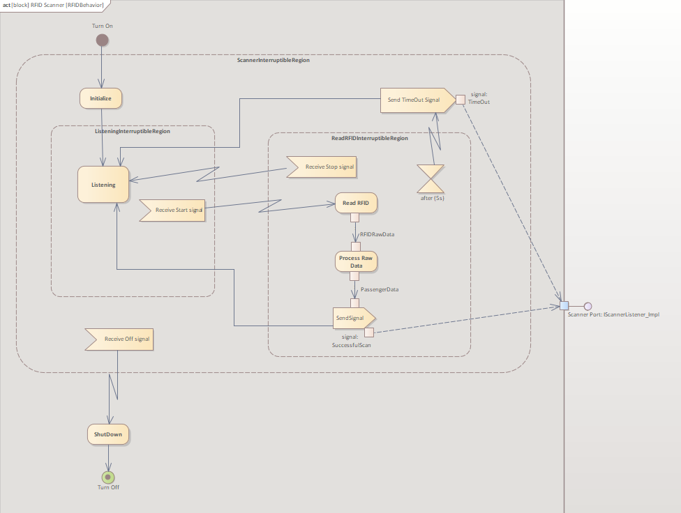
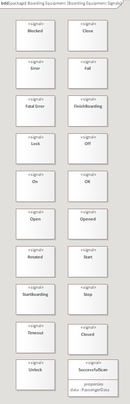
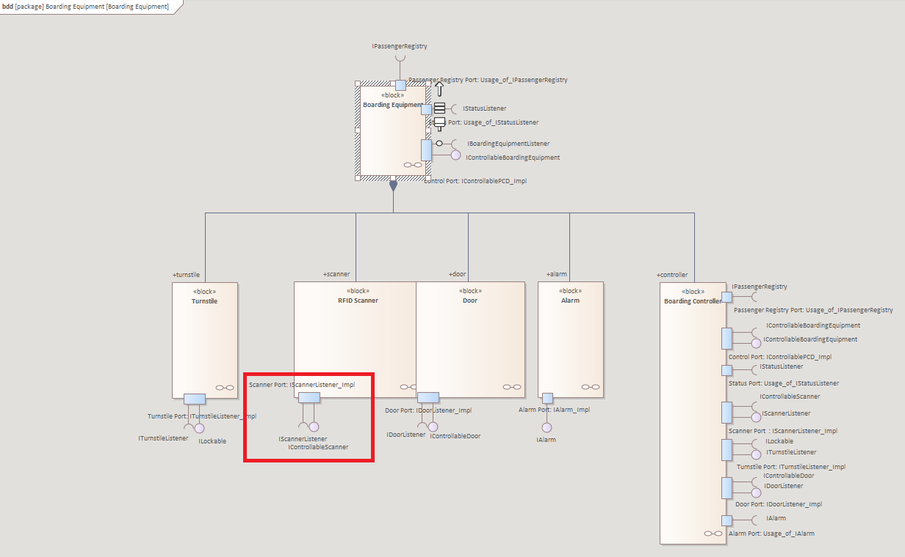
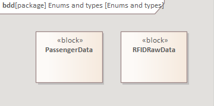

## Activity Diagram Of the RFID Scanner
1. **Diagram**
2. **Specification**
3. **Glossary**
4. **Sources**

### 1. **Diagram**:

*IntelliBus System/4 - Functional Architecture/4.1 Functional decomposition/Boarding Equipment/RFID Behavior*

### 2. **Specification**:
After the *Turn On* initial node, the system enters the *ScannerInterruptibleRegion*, this region can be interrupted with *Receiving Off Signal* (Sources: Boarding Equipment Signals). Since we turned on the scanner, it can be turned off at any given time. After receiving *Off* signal, the scanner leaves the *ScannerInterruptibleRegion*, and moves on to the *ShutDown* action, that handles shutdown processes. Once the shutdown processes are complete, the system reaches its final state: Turn Off

The *ScannerInterruptibleRegion* starts with the *Initialize* action, after the initializing is done, the *Listening* action begins, in the *ListeningInterruptibleRegion*. The interruptible region can be interrupted by *Receiving Start signal* (Sources: Boarding Equipment Signals). 

If start signal is received in the *Listening* action, the  *Read RFID* action begins, in the 
*ReadRFIDInterruptibleRegion*, what can be interrupted by *Receiving Stop signal* (Sources: Boarding Equipment Signals) or with timeout, if the system is in the *ReadRFIDInterruptibleRegion* for more than 5 seconds.
- In case *Receiving Stop signal* the scanner stops the current action within the *ReadRFIDInterruptibleRegion*, and returns then continues with the *Listening* action.
- In case of timeout, the *Send TimeOut Signal* action begins, the scanner sends a *Timeout* signal (Sources: Boarding Equipment Signals) to the scanner port (Sources: Boarding Equipment)

When reading is completed in the *Read RFID* action, it passes the *Process Raw Data* action an *RFIDRawData* (Sources: Enums and types) object. 

When the raw data is processed in the *Process Raw Data* action, it passes the *PassengerData* (Sources: Enums and types) object to the *SendSignal* action. In this action the scanner sends the *scanner* port (Sources: Boarding Equipment) a *SuccesfulScan* signal (Sources: Boarding Equipment Signals), this interface has the *PassengerData* property.

After sending the signal, the scanner returns then continues with the *Listening* action, waiting for the next *Start* signal. 

*Note that an action that is inside multiple InterruptibleRegion, can be interrupted with multiple signals. e.g: *Listening* action can be interrupted with an *Off* signal (*ShutDown* action starts), and *Stop* signal (*Read RFID* action starts) aswell.* 

### 3. **Glossary**:
#### Nodes:
- **Turn On**: Initial node, produces a control token when the Activity is invoked, the scanner's activity is invoked by *turning on* the scanner.
- **Turn Off**: Final node, removes all control tokens and returns from the Activity.
#### Actions:
- **Initialize**: Initializing. 
- **Listening**: Waiting for a *start* signal. 
- **Read RFID**: Reading RFID data.
- **Process Raw Data**: Processing raw RFID data.
- **SendSignal**: Sending signal to the *scanner* port (Send Signal type action).
- **Send TimeOut Signal**: Sending timeout signal to the *scanner* port (Send Signal type action).
- **ShutDown**: Shutting down.
#### Accept event actions:
- **Receiving Start signal**: Receives a *Start* signal
- **Receiving Stop signal**: Receives a *Stop* signal
- **Receiving Off signal**: Receives an *Off* signal

#### Interrupt regions:
- **ScannerInterruptibleRegion**: Contains all action except ShutDown.
- **ListeningInterruptibleRegion**: Contains the *Listening* action
- **ReadRFIDInterruptibleRegion**: Contains *Read RFID*, *Process Raw Data* and *SendSignal* actions

### 4. **Sources**:

#### The signals are used from the following model:
(Boarding Equipment Signals)

 

*IntelliBus System/4 - Functional Architecture/4.4 Signals/Boarding Equipment/Boarding Equipment Signals*

#### The scanner's port is used from the following model:
(Boarding Equipment)

 

*IntelliBus System/4 - Functional Architecture/4.1 Functional decomposition/Boarding Equipment*

#### Data types in *ReadRFIDInterruptibleRegion* are used from model:
(Enums and types)

 

*IntelliBus System/4 - Functional Architecture/4.4 Signals/Enums and types*