# Assignment 1

Author: `Terry Davis Fan Club`

# Stakeholders

## Use Case Diagram for Stakeholders:

We define stakeholders as entities interested in or influencing the project.

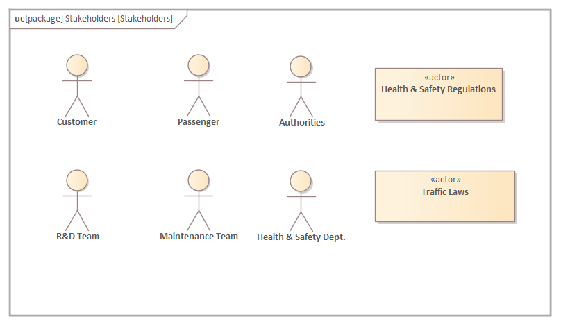

As it is clearly visible, the key stakeholders in the IntelliBus project are the `Customer`, the `R&D Team`, the `Maintenance Team`, the `Health & Safety Department`, the `Authorities` and the `Passengers`. Additionally, the current and proposed `Health and Safety regulations` - as well as `Common Traffic Law` - influence the development of the project.

### Customer

The customer defines the primary requirements and desired outcomes for the project. They are the ones who will use and benefit from the autonomous vehicles, thereby having a significant say in the project's direction and expectations.

### R&D Team

The R&D team is responsible for designing and developing the IntelliBus system. Their role greatly influences the project, as they are responsible for ensuring safety and efficiency, that the customer requirements are met.

### Passenger

As the end-users of the system, the passengers' input is crucial to understanding safety and usability concerns.

### Maintenance Team

The maintenance team ensures that the autonomous vehicles are in optimal working condition, while also providing maintenance and service to all of the vehicles. The maintenance team is also responsible for manual system overrides in case of an anomaly.

### Authorities

Authorities oversee and enforce the regulations governing the use of autonomous buses, especially in private properties. Their approval is essential for the lawful operation of the IntelliBus system.

### Health & Safety Department

The Health & Safety Department is responsible for ensuring the autonomous vehicles are safe for use by passengers and don't pose health risks.

### Health & Safety Regulations

Health & Safety Regulations provide the standard framework of safety and health measures. Meeting these regulations is crucial for the lawful deployment and operation of the IntelliBus system.

### Traffic Laws

Even though the vehicles operate on private property, as per the customer's requirements, they still need to adhere to common traffic laws.

---

# System Context

## Block Definition Diagram:

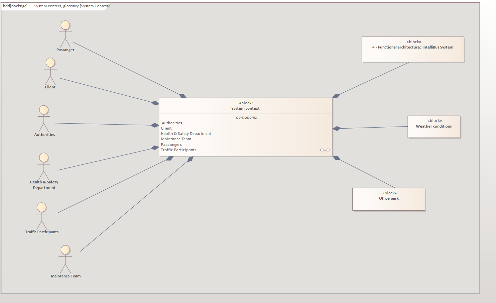

#### IntelliBus system:

    - Responsible for coordinating the operation of autonomous buses and managing transportation requests.

#### Office Park:

    - Represents the physical environment within which the autonomous buses operates.

#### Passengers:

    - Represents the individuals working within the office park who utilize the transportation service.
    - Initiates transportation requests.

#### Terminals:

    - Dedicated terminals located in front of major office buildings.
    - Allows passengers to publish transportation requests.

#### Maintenance Team:

    - A group of 2-3 personnel stationed on-site.
    - Authorized to intervene in case of technical issues with autonomous buses.

#### Traffic Participants:

    - Represents individuals sharing the roadways with IntelliBuses.
    (- IntelliBusses must safely interact with them)

#### Weather Conditions:

    - Represents environmental factors impacting IntelliBus operations.
    (- Autonomous vehicles must adapt to varying weather conditions.)

#### Health & Safety Department:

    - Department responsible for health and safety compliance within the park.
    - Influences safety-related aspects of IntelliBus operation.

## Internal Block Diagram:

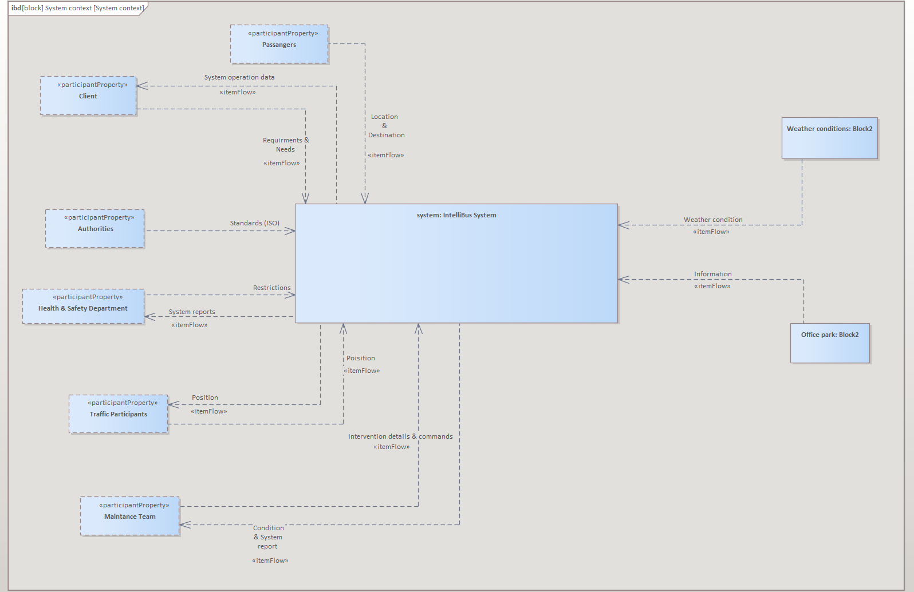

#### Passangers -> IntelliBus System

    - The passanger communicates with the system, sharing his location and desired location (through application or terminal)

#### Client <-> IntelliBus System

    - The client shares requirments and needs with the system.
    - The system shares operational data with the client

#### Authorities -> IntelliBus System

    - Authorities create standards (ISO), that the system must fulfill.

#### Health & Safety Department <-> IntelliBus System

    - Health & Safety Department creates restrictions for the system
    - The system shares system reports with the H&S department

#### Traffic Participants <-> IntelliBus System

    - IntelliBus detects Traffic Participants position, so accidents can be avoided.
    - Traffic Participants can see the IntelliBuses position (avoiding accidents)

#### Maintance Team <-> IntelliBus System

    - The system sends system reports to the maintance team (monitoring condition)
    - The maintance team can send intervention details and commands to the IntelliBus system

#### Weather Conditions -> IntelliBus System

    - The system can detect extreme wether conditions, and adapt to it

#### Office Park -> IntelliBus System

    - IntelliBuses obtains information about the office park (roads, building, obsticles, etc.)

# High-level requirements

Based on the customer's specification, our system designer team created the product's system requirements categorized by the <ins>FURPS3 (Functional, Usability, Reliability, Performance, Safety, Security, Support)</ins> theory.

---

**All quotations are from the customer specification and remarkable quotes for references.**

---

**High-level overview of the categorization:**

**Functional Requirements**

- "The buses should get around autonomously inside the site, selecting their route automatically based on the
  current demand." -> **Absolutely functional, without this criteria the system would not exist.** -> <ins>R1, R1.1, R2</ins>

- "To this end, we expect the installation of dedicated terminals in front of every major office
  building through which passengers can publish their transportation requests. We also want to make this feature
  available as a mobile application, which will let registered users publish their requests in advance (even for
  larger groups)." -> **Without transportation requests the system would make no sense, hence it is functional.** -> <ins>R4, R4.1, R4.2</ins>

- "The buses must not have any permanent personnel on board, but it is acceptable to have a group of 2-3
  people stationed on site who can intervene (either remotely or manually) in case of a technical problem.
  " -> **This is the main reason why we can call it autonomous so it is functional as well.** -> <ins>R3, R5, R5.1, R5.2</ins>

- "Currently, traffic in the office park is limited to authorized vehicles, cyclists and pedestrians. Common traffic
  law is effective. We are ready to regulate authorized vehicles further (e.g., with additional signals or traffic lights),
  but the buses must avoid causing accidents. The autonomous vehicles must be able to react to the behavior of
  cyclists and pedestrians." -> **It is questionable but in conclusion no one would be proud of accidents involving human beings, therefore it should be considered functional.** -> <ins>R8, R8.1, R8.2, R8.3, R8.4</ins>

- "We will build a dedicated station in the park for storage and maintenance.
  In case of a non-critical failure, the buses should be able to notify the maintenance team and return to the
  station autonomously." -> **The team would consider it functional to do not violate the autonomous requirement and as the costumer would build a station for the product.** -> <ins>R6</ins>

- "Before acceptance, we plan to have a 30-day test run during which the system will be evaluated based on
  the number of transported persons and the number of external interventions.
  " -> **It is absolutely essential because without the requirement the business would not be successful.** -> <ins>R7</ins>

---

**Performance Requirements**

- "We expect the buses to be able to complete at least 100 km on average between two
  interventions.
  " -> **It is not a functional requirement because the bus can be a well designed system with more interventions within the distance, the specified value is considered as a performance need.** -> <ins>R9</ins>

- “During lunch time, we expect around 1000 people to use the service. It would be nice if they could have
  their meal in the lunch break.”
- “How will you make sure the buses are not overcrowded?”

-> **The statements are reflect to the necessity of great system performance like scaleability and rout optimizations for quicker rides which is essential to avoid overcrowding.** -> <ins>R11, R11.1, R11.2</ins>

-> **Furthermore to achive the performance goals above the system should support fast data exchange and quick intervention time which would cause service cancellation.**
-> <ins>R10, R12</ins>

---

**Reliability Requirements**

- "The buses must be able to operate under any weather conditions, but the time of operation is limited to
  between the hours of 7 AM and 10 PM." -> **Without these requirements the system would work, in conclusion these are more likely to provide the reliability of the system.** -> <ins>R13, R13.1, R13.2</ins>

-> **To make sure that the system is reliable enough the team added some extra features like redundancy measures and fault tolerance to a certain extent.** -> <ins>R14, R14.1, R15</ins>

---

**Safety Requirements**

- “Whatever the Health&Safety Department accepts.”, “Obviously, we have to comply with health&safety regulations.”
- “Be prepared that the Health&Safety Department will always want more data about the system.”
- “Of course they should not crash, but if they do, it would be nice to have some sort of black box.”
- “The Health&Safety Department is almost as afraid of the authorities as we are afraid of them.”
- “Of course they should not crash, but if they do, it would be nice to have some sort of black box.”

-> **These quotes are the customer's concerns regarding to the systems safety compliance, but the team have prepared for the possible issues and planned several safety factors to complete the requirements** -> <ins>R16, R16.1, R16.2, R17, R18, R19, R20, R21, R21.1, R21.2</ins>

---

**Security Requirements**

- “Last year we had a bad privacy leakage incident, so we want to make sure it doesn’t happen again.”
- “Our colleague John has already joked with hijacking your buses and organizing drag races.”

-> **The security requirements generally generated as the results of other requirements and the goal is to provide a safe environment for the system** -> <ins>R22, R23, R24, R25, R26, R27, R28, R29, R30, R31</ins>

---

**Suportability Requirements**

- “We have not decided if this will be a free service or not.” -> **The requirement is regarding to the scaleability of the system in a functional way. The client did not give enough requirements how to provide supports for product, but the team increased these numbers and added features to ensure customer satisfaction.** -> <ins>R32, R33, R34, R35, R36, R37, R38, R39, R40</ins>

---

**Usability Requirements**

- “Who would want to stand in the pouring rain for hours…”
- “We don’t want clumsy login screens, make it simple and efficient.” -> **In case of a system mostly used by human beings is critical to be useable, our collection of useability requirements cover the client's pretension and much more.** -> <ins>R41, R42, R43, R44, R45, R46, R47, R48</ins>

---

# High-level Use Cases

## Use-Case Architecture

### Packages

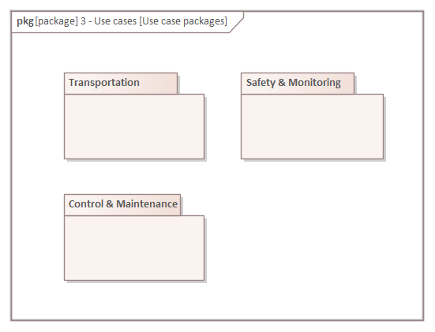

Use cases of the IntelliBus system are further broken down into three submodules.

#### Transportation

Transportation use cases define activities that are related to transporting end-users around company property. This includes submitting ride intents, traveling on board, optimizing bus routes, and more.

#### Control & Maintenance

The IntelliBus System needs to implement ways to grant manual access to authorized users in case of emergencies and system failures. Control & Maintenance use cases define actions that help maintain the buses (including scheduled, post-incident and malfunction-related maintenance) and grant manual access to the vehicles.

#### Safety & Monitoring

Use cases related to security and monitoring allow the Authorities, along with the Health & Safety department, to read black-box events and access security-related data through the IntelliBus system.

### List of Use Cases

All of the high level use cases are represented in the diagram below.

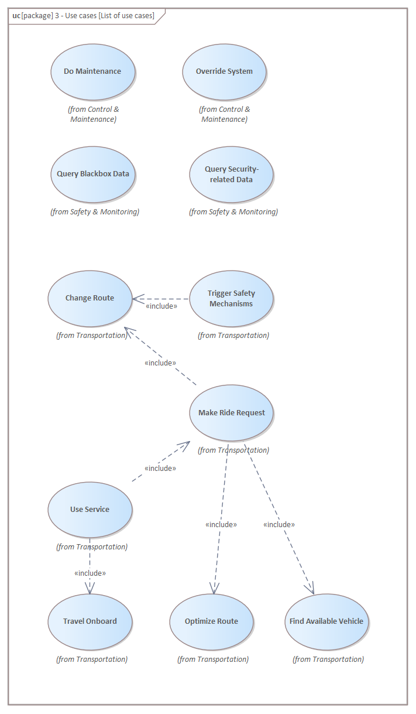

## System Use Cases

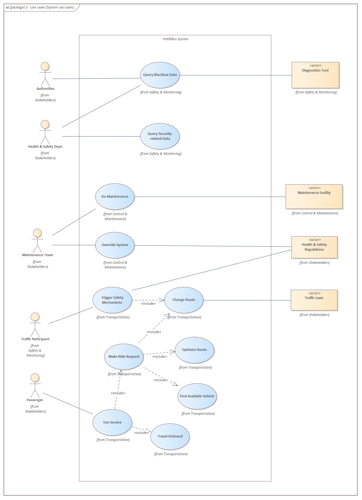

### Transportation

### Safety & Monitoring

#### Query Blackbox Data

**Objective(s):** Personnel representing the Authorities and the Health & Safety Department can gain access to events stored on every bus' black-box using an external diagnostic tool.

**Actor(s):** Authorities, Health & Safety Department

**Includes:** -

**Extension Point(s):** -

**Preconditions(s)**

- The black-box is intact
  **Postconditions(s)** -
  **Information Item(s)**
- BlackboxHistory: list of black-box event containing timestamps

**Flow(s)**

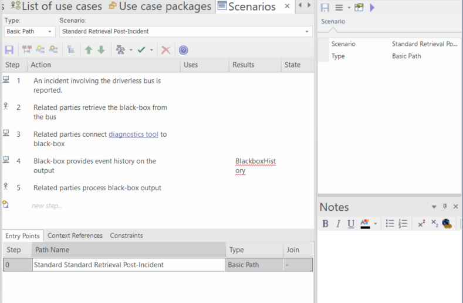

### Query Security-related Data

**Objective(s):** Personnel representing the Health & Safety Department can query security related events from an internal data source.

**Actor(s):** Health & Safety Department

**Includes:** -

**Extension Point(s):** -

**Preconditions(s)** -

**Postconditions(s)** -

**Information Item(s)**

- QueryParameters: filters and conditions for the returned items
- SecurityEvents: the requested security-related events

**Flow(s)**

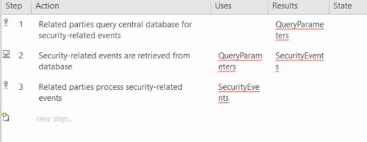

### Trigger Safety Mechanism

**Objective(s):** Personnel representing the Health & Safety Department can query security related events from an internal data source.

**Actor(s):** Traffic Participant (either a vehicle or a person participating in traffic on company property)

**Includes:** Change Route

**Extension Point(s):** -

**Preconditions(s)** -

**Postconditions(s)** -

**Information Item(s)**

- SafetyHazardException: a Safety Hazard appears involving the bus
- HazardMitigationResults: the details of the mitigated hazard
- SafetyReport: a report about the safety hazard
- SafetyIncidentException: exception of the incident involving the vehicle

**Flow(s)**

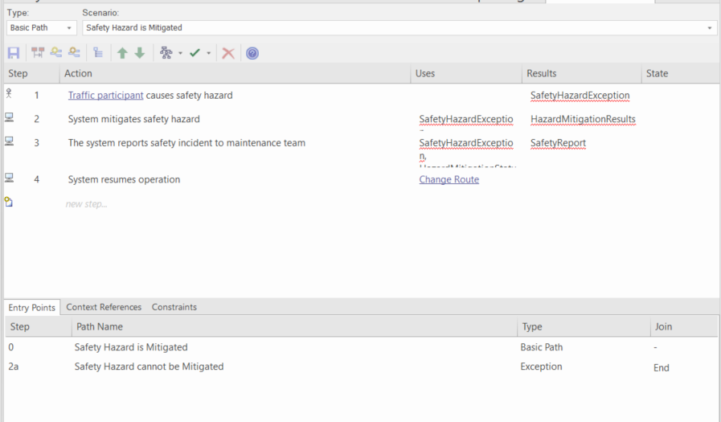

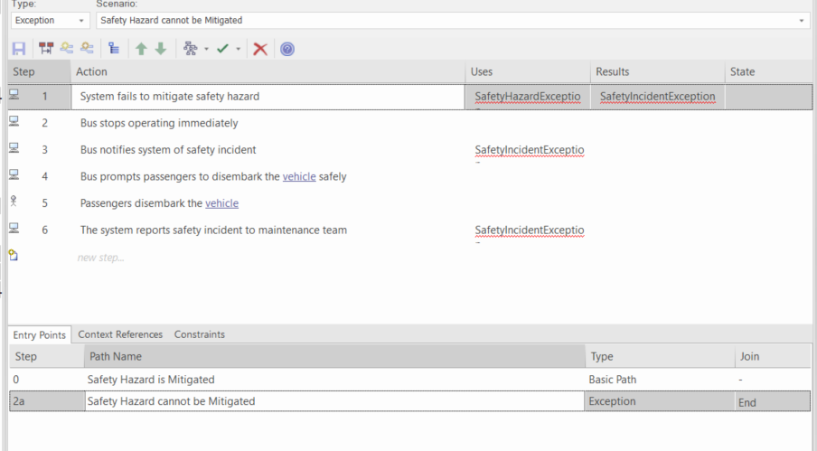

**Activity Diagram**

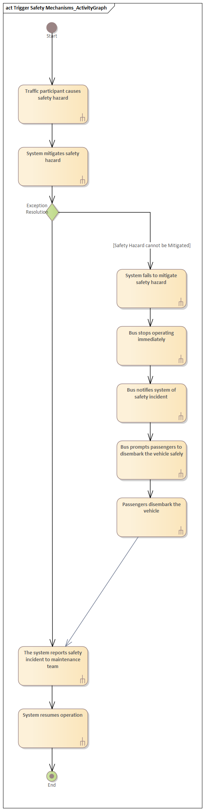

### Control & Maintenance

### Do Maintenance

**Objective(s):** This use case defines the scenarios related to keeping buses operational. Maintenance Operations take place at the Maintenance Facility provided by the Customer.

**Actor(s):** Maintenance Team, Maintenance Facility (secondary)

**Includes:** -

**Extension Point(s):** -

**Preconditions(s)**

- A bus needs maintenance provided by the maintenance team

**Postconditions(s)** -

**Information Item(s)** -

**Flow(s)**

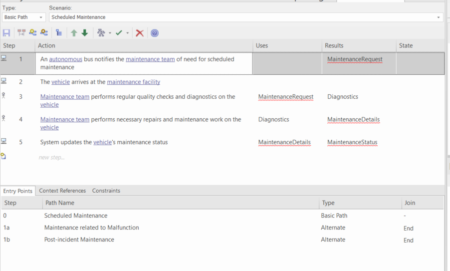

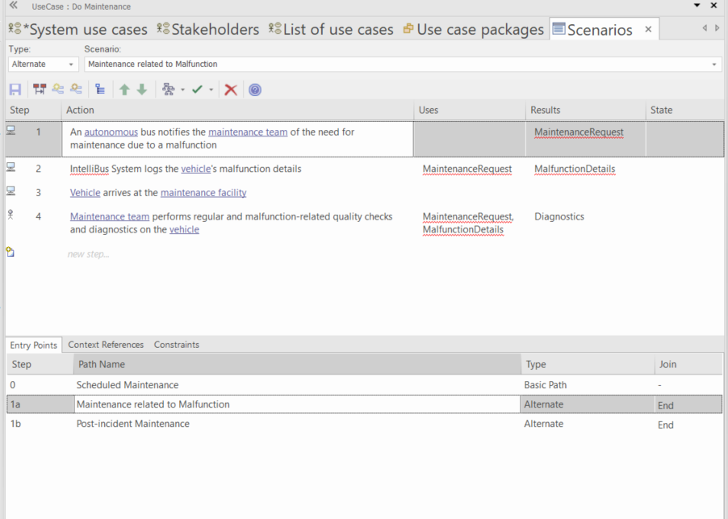

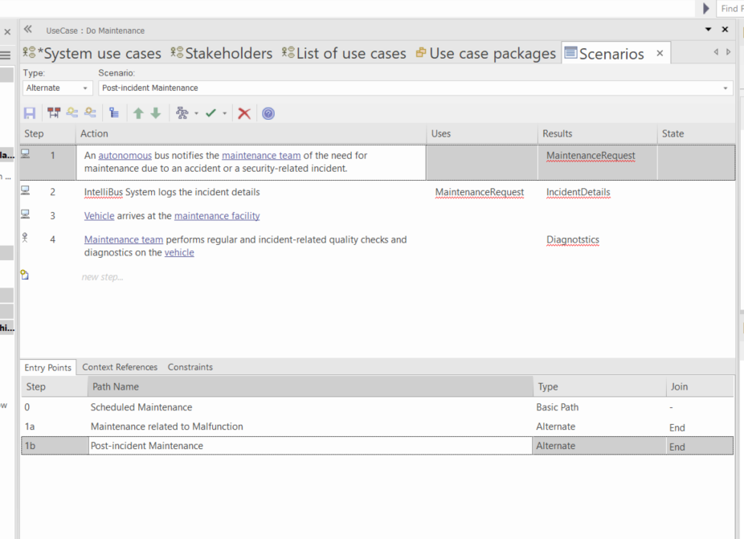

**Activity Diagram**

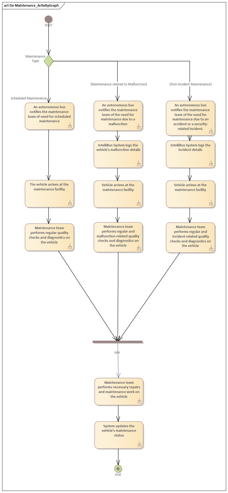

### Override System

**Objective(s):** In cases of system failures and incidents, the maintenance team can receive access from the system to intervene in the operation of IntelliBus buses.

**Actor(s):** Maintenance Team

**Includes:** -

**Extension Point(s):** -

**Preconditions(s)** -

**Postconditions(s)** -

**Information Item(s)**

- SuspensionRequest: the maintenance team's request to suspend operation

**Flow(s)**

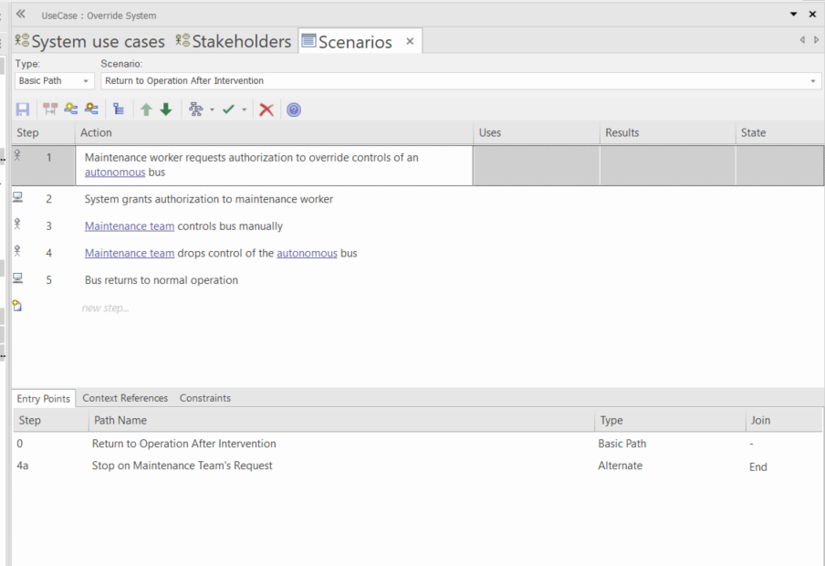

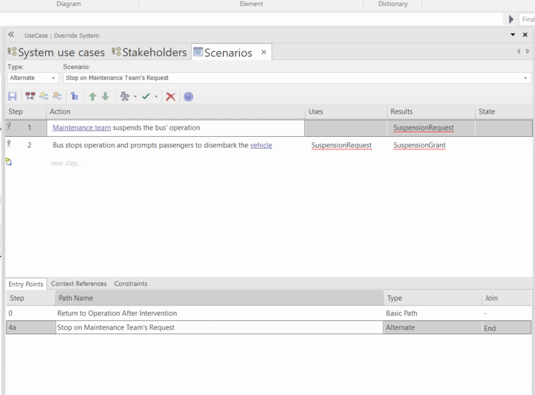

**Activity Graphs**

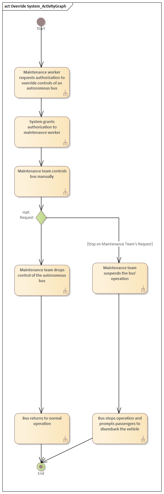

### Use Service

**Objective(s):** Passengers can use services provided by the IntelliBus System, including requesting rides and traveling on vehicles.

**Actor(s):** Passenger(s)

**Includes:** Make Ride Request, Travel Onboard

**Extension Point(s):** -

**Preconditions(s)**

**Postconditions(s)** -

**Information Item(s)**

- RideRequest: a validated request from a passenger
- RideDetails: details of the accepted ride
- RideData: data generated on board

**Flow(s)**

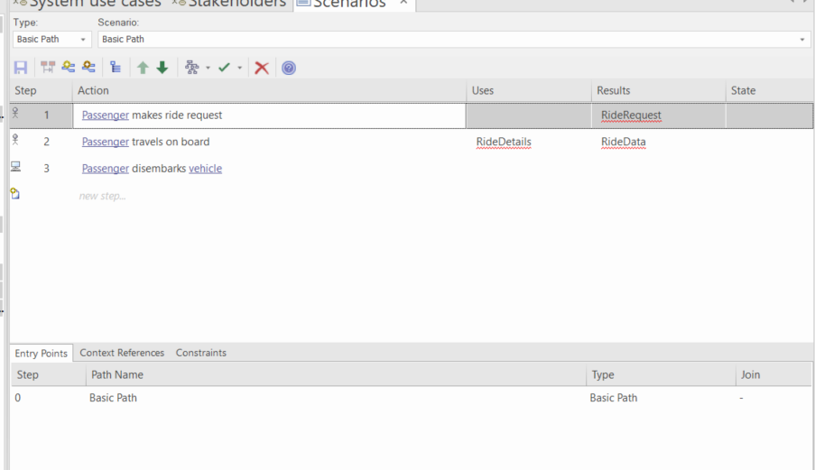

### Make Ride Request

**Objective(s):** Passengers can make ride requests towards the system, which can either be approved or rejected. It includes finding an available bus, optimizing its route and requesting a route change request from it.

**Actor(s):** Passenger(s)

**Includes:** Change Route, Optimize Route, Find Avaliable Vehicle

**Extension Point(s):** -

**Preconditions(s)** -

**Postconditions(s)** -

**Information Item(s)**

- RideRequest: the (yet unvalidated) ride request from the passenger
- Vehicle: the vehicle that can handle passenger pickup
- Route: the optimal route for the journey that shall be passed along to the bus
- RideDetails: the details of the accepted ride

**Flow(s)**

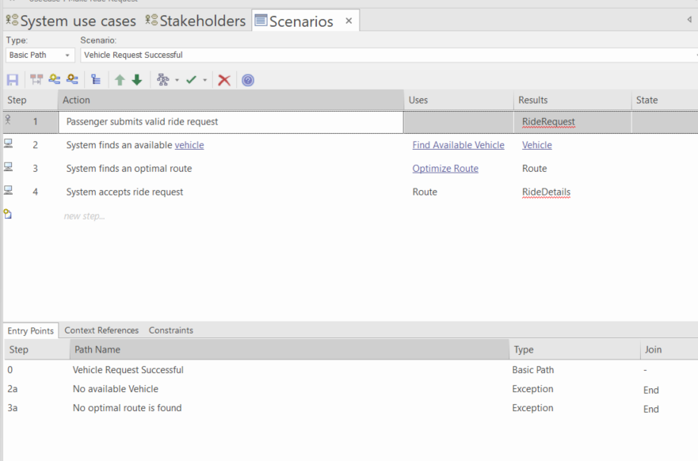

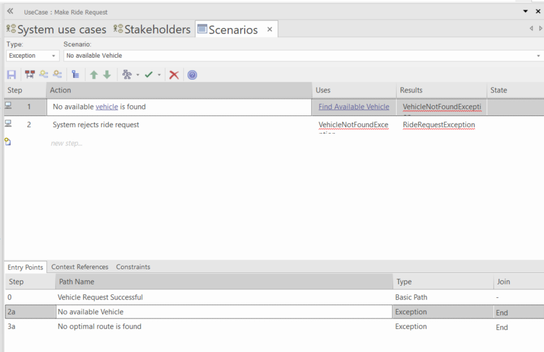

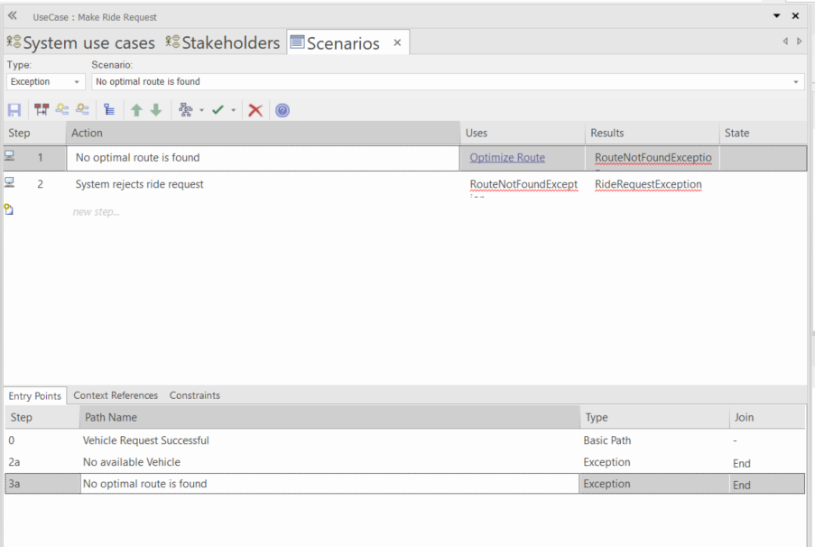

### Change Route

**Objective(s):** The System changes vehicle routes based on security incidents, current demand and availability of other vehicles.

**Actor(s):** Traffic Participant, Passenger

**Includes:** -

**Extension Point(s):** -

**Preconditions(s)** -

**Postconditions(s)** -

**Information Item(s)**

- RouteChangeDetails: the details of the route change

**Flow(s)**

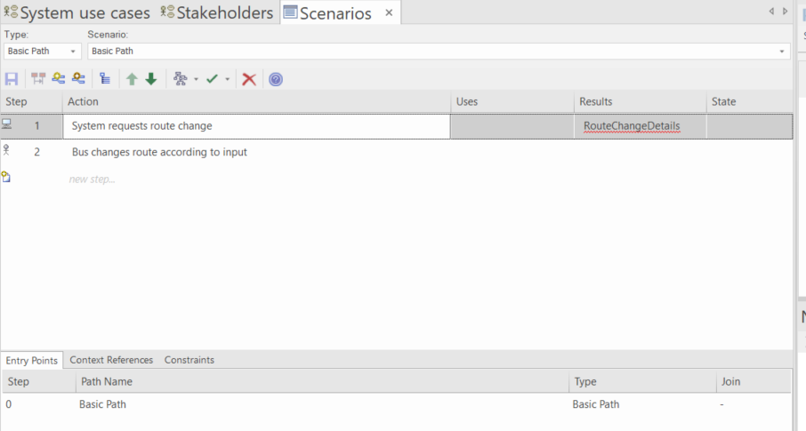

### Optimize Route

**Objective(s):** The system optimizes bus routes with regard to the actual state of the whole system, to make rides faster and more efficient.

**Actor(s):** Passenger(s)

**Includes:** -

**Extension Point(s):** -

**Preconditions(s)** -

**Postconditions(s)** -

**Information Item(s)**

- RouteRequestParams: the parameters for the route search
- Route: the most optimal route that fits the parameters
- RouteNotFoundException: an exception notifying the system about the lack of routes fitting the search criteria

**Flow(s)**

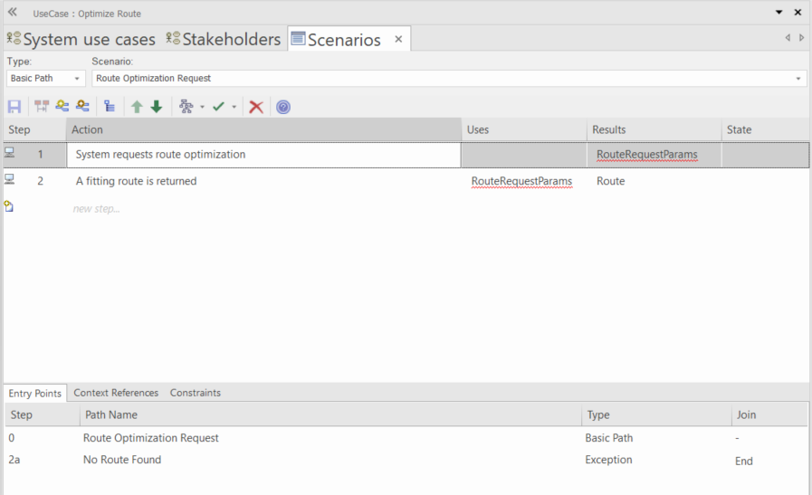

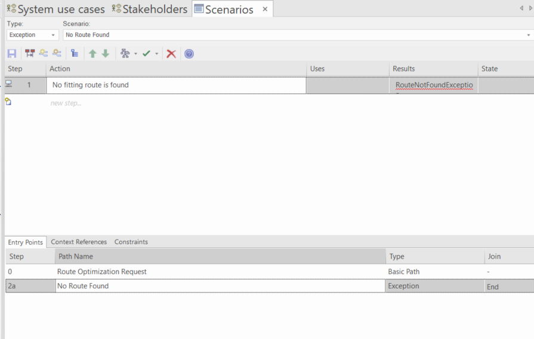

### Find Available Vehicle

**Objective(s):** The system shall be able to find buses that have the necessary capacity to fulfill a new ride request, and throw an exception if the request cannot be completed.

**Actor(s):** Passenger(s)

**Includes:** -

**Extension Point(s):** -

**Preconditions(s)**

**Postconditions(s)**

**Information Item(s)**

- VehicleSearchParams: parameters for the vehicle search
- Vehicle: the chosen vehicle
- VehicleNotFoundException: an exception notifying the system about the lack of vehicles fitting the criteria

**Flow(s)**

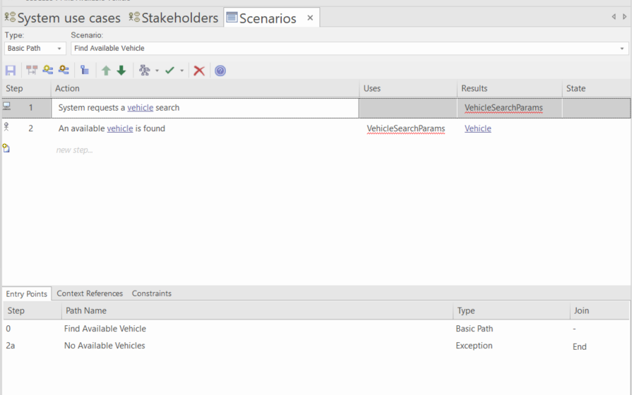

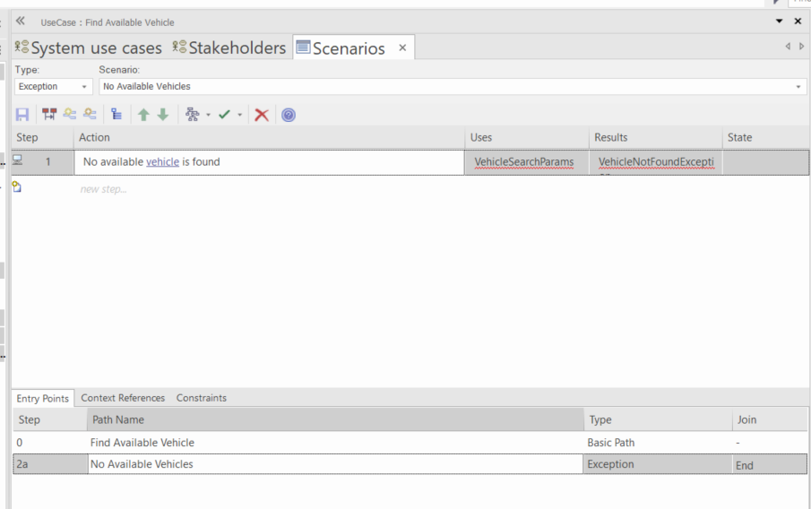

### Travel Onboard

**Objective(s):** Passengers can board buses and they get notified of their arrival by the system.

**Actor(s):** Passenger(s)

**Includes:** -

**Extension Point(s):** -

**Preconditions(s)** -

**Postconditions(s)** -

**Information Item(s)**

- RideRequest: a validated ride request from a passenger
- RideData: information and metrics about the passenger's ride with IntelliBus

**Flow(s)**

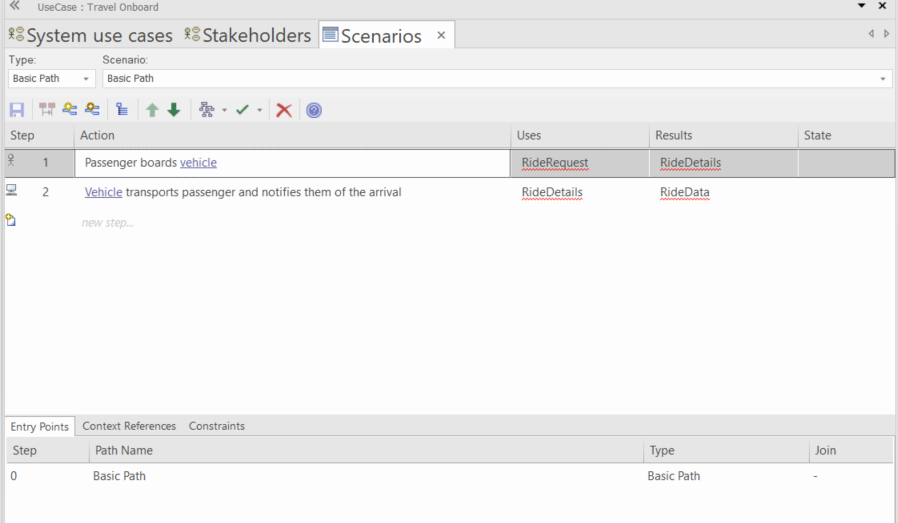
