# Assignment 3

Author: `Terry Davis Fan Club`

# Safety Analysis - Evaluating an Adaptive Cruise Control

Our system designer team have had to focus on the safety of a crucial component of the autonomous vehicle: the
**Adaptive Cruise Control (ACC)** component. In the followings, our team documented the procedure of the ACC's **safety analysis** to a great extent.

<ins>The component's short description:</ins> *Basic Cruise Control can maintain the speed set by the driver by
accelerating or decelerating. ACC extends this functionality with sensing the distance of the vehicle in front of
us and adjusting our speed to keep a safe following distance.*

<ins>We have pointed out several statements during the designing phase:</ins>
- We have focused on only the **speed information** (and not the distance yet).
- The speed is measured using two different methods simultaneously:
    - **3DM-GX5-10 IMU** (Inertial Measurement Unit) provides movement data directly based on its internal sensors.
    - The **movement of the four wheels** are measured
    independently using encoders, one for each wheel.
- The data of the encoders is **fed into a microcontroller** - <ins>at least half of the encoders are working correctly.</ins>
    - The data sent to the **main logic unit**.
        -  The system <ins>does not stop</ins> if the output of an encoder is detected to <ins>differ from the others.</ins>
- The **maximum of the two measurements** is used to increase safety and processed by the main logic unit of the ACC.
    -  The output is the command to *accelerate*, *decelerate* or *maintain speed*.
- A small **voter FPGA** is used as a shield to derive the <ins>final command</ins> or initiate a <ins>safe emergency shutdown</ins> of the system.
    - If the commands from the two **main logic units are the same, the final command will be that, otherwise the system shuts down**.
    - **Duplicated**, check their own output against that to initiate safe emergency shutdown <ins>when they see any discrepancy.</ins>
- *In case of an emergency shutdown, as the problem might be transient, the system is automatically restarted.
Note: The failure rates in this task include only permanent failures, but the functional logic of the system must
consider the possibility of transient failures too. In the final implementation, this will be replaced with a better
solutions to reliably detect permanent faults, but for the prototype, this will suffice. A practical consequence of
this is that both voters can become faulty, in which case they might produce the same erroneous output.
In the whole system, communication through wires or channels is assumed to be either reliable or the
probability of communication faults is already considered in the reliability metrics of the receiving component.*
- Each microcontroller’s power is provided by the **single main power supply**.
    - A dedicated <ins>5V</ins> power regulator.
    - If the corresponding regulator **fails**, that leads to <ins>non-deterministic behaviour.</ins>
- *Every other component that needs external power is supplied from the main power supply without any additional regulator in the power chain. (Note: If voltage conversion would be logically
needed for such components, you can treat it as already being included in the component’s failure rate.) The failure of the main power supply can be ignored in the current design phase.*
- *At the end of each day (treat a day as 24h, regardless of the actual duration of active operation), the vehicles return to the maintenance station for full maintenance. We can assume for now that this maintenance leads to full recovery, meaning that the vehicles start each day as if they were new.*
- **The failure rates for some components are given in the following table:**

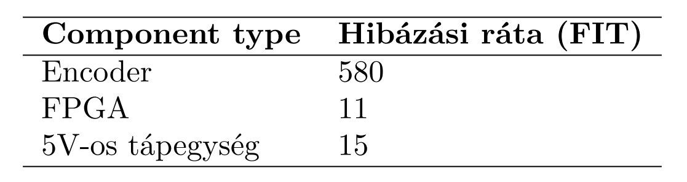

- The microcontrollers are **SIL2 certified**, and are used in a <ins>continuous operation mode.</ins> 
- The **reliability properties** of the IMU can be found in its **public datasheet**
    - Vendors often use <ins>MTBF instead of MTTF</ins> because repair time is negligible.

---

## **Fault tree model of the ACC with the event “The ACC commands the vehicle to accelerate when it should not” as the top event**

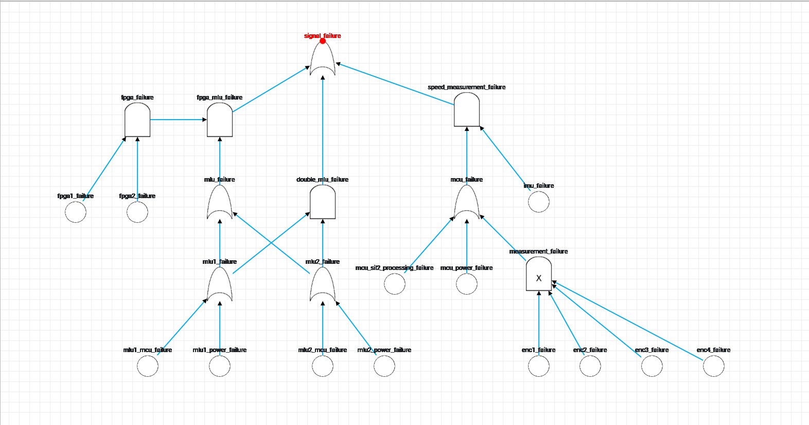

In the context of propagating false acceleration signals, the following scenarios must be considered.

## IMU and Encoder Failure
If the IMU and the encoding unit fails simultaneously, the system could propagate an acceleration signal, even when the ACC should produce a different signal.

The encoding module can fail for the following reasons:

1. The microcontroller that handles encoder data fails during processing.
2. The regulator attached to the aforementioned MCU fails.
3. More than 2 encoders fail.

## Main Logical Unit and FPGA Failure
If the main logical units and the FPGAs fail simultaneously, the system can produce a false acceleration signal.

Both of the FPGAs have to fail simultaneously (producing a `TRUE` signal for outputting the acceleration), and at least one Main Logical Unit has to fail, prompting the system to accelerate.

We assume that when both FPGAs fail, and at least one Main Logical Unit produces the acceleration command, the system can ingest the acceleration command, rather than the other MLU's command.

The MLUs can fail for the following reasons:

1. The regulator attached to the MLU fails.
2. The MCU produces an incorrect output.

---

## **Qualitative analysis, minimal cut sets and SPoFs**

To perform this <ins>qualitative analysis</ins>, our team used a professional software, called **SAFEST** to define the *minimal cut sets* derrived from the *fault tree*.

This feature is available from the **tool bar** in the <ins>upper left corner</ins>:

**The minimal cut sets are:**

<ins>There are nine cut sets which were generated from the fault tree.</ins>

1. imu_failure , mcu_power_failure_mcu_sil2_processing_failure

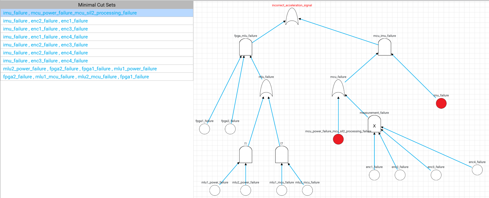

2. imu_failure , enc2_failure , enc1_failure

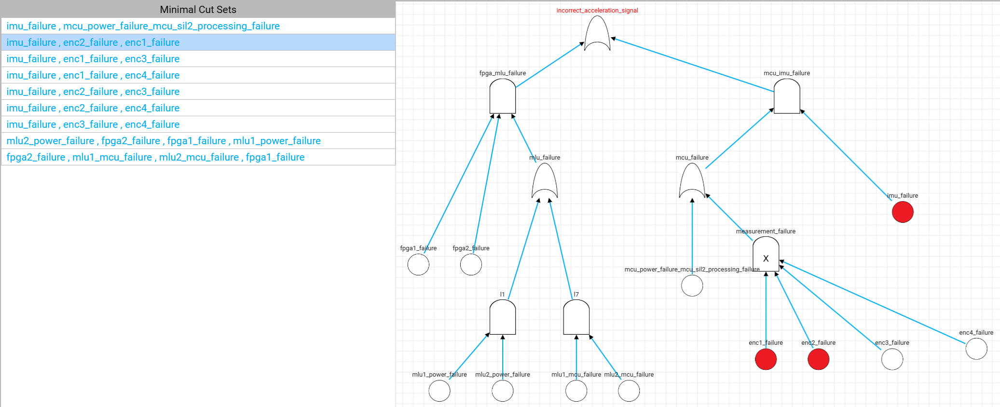

3. imu_failure , enc1_failure , enc3_failure

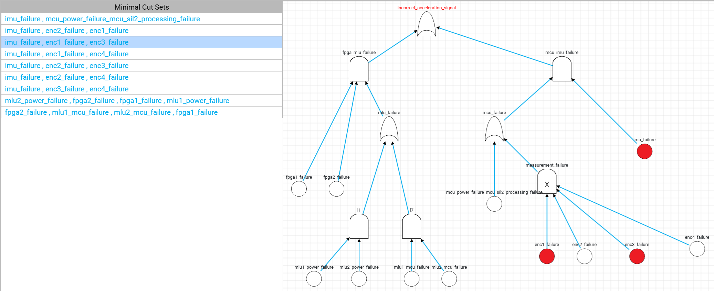

4. imu_failure , enc1_failure , enc4_failure

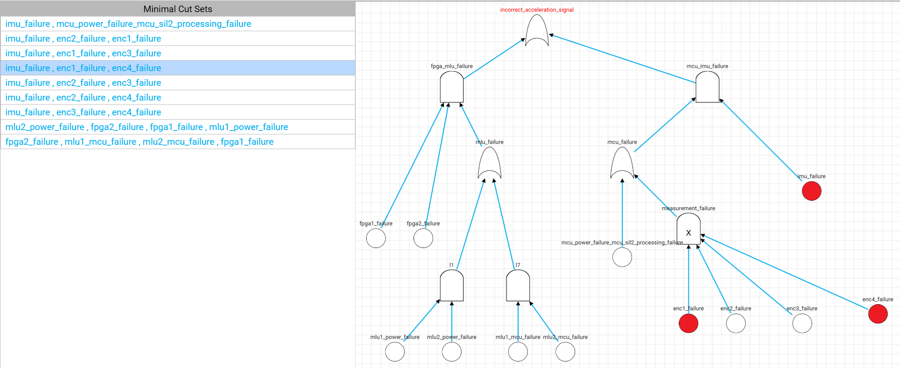

5. imu_failure , enc2_failure , enc3_failure

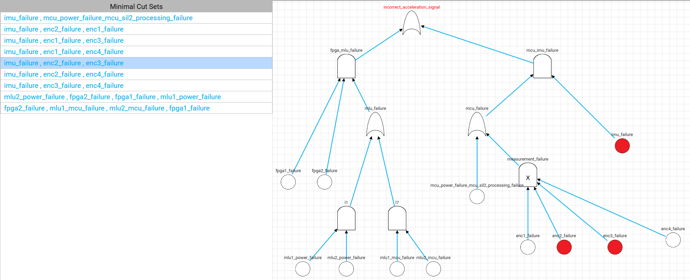

6. imu_failure , enc2_failure , enc4_failure

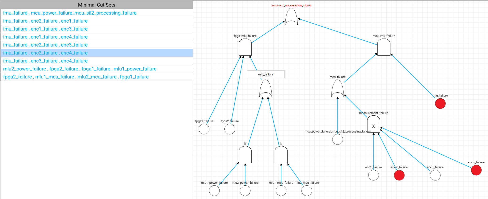

7. imu_failure , enc3_failure , enc4_failure

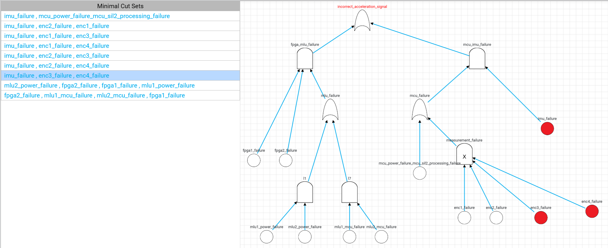

8. mlu2_power_failure , fpga2_failure , fpga1_failure , mlu1_power_failure

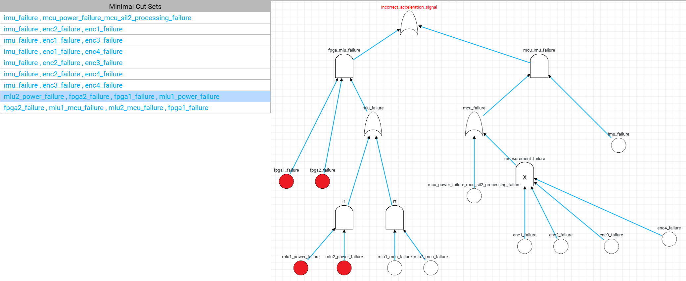

9. fpga2_failure , mlu1_mcu_failure , mlu2_mcu_failure , fpga1_failure

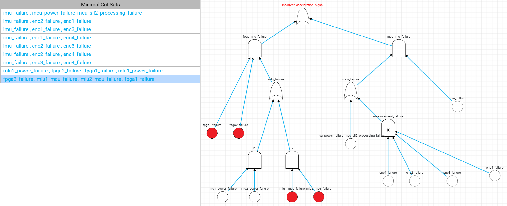

**The SPoFs are:**

<ins>There are only two part of the system, if those fail, will stop the entire system from working.</ins>

1. fpga_mlu_failure

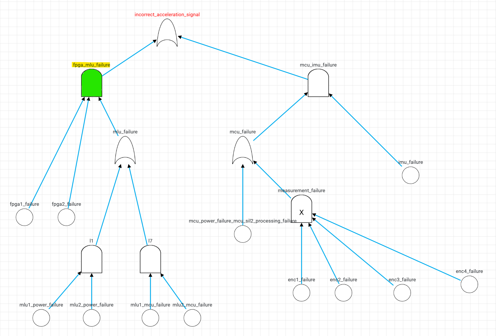

2. mcu_imu_failure

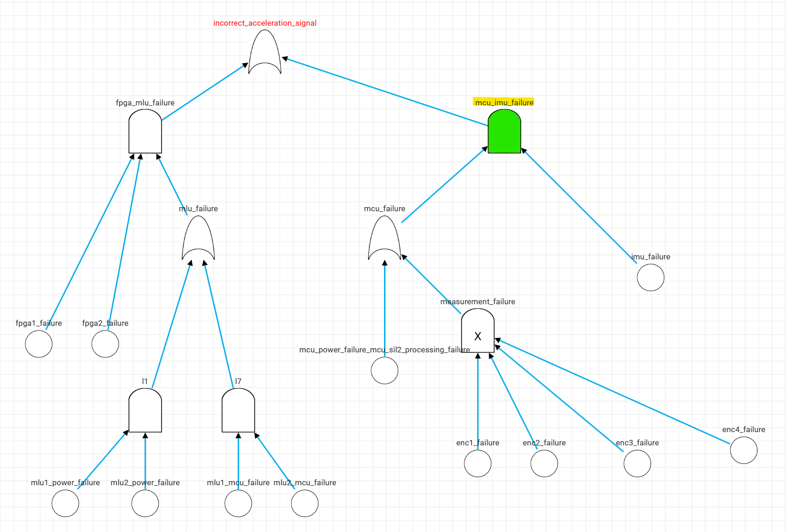

# Quantitative Analysis

We can calculate the probability of a false acceleration signal using the Fault Tree from before.

For the sake of giving a conservative estimate for the probability of an incorrect acceleration signal, we only consider worst-case scenarios. Therefore, we accept the following assumptions as true:

- If the number of failing encoders is higher than the threshold (`2`), we assume that the encoders give a lower estimate of the speed. This prompts the control unit to trigger the acceleration signal.

- If the microcontroller (that processes encoder data) fails (either through a processing failure or the failure of its regulator), we assume that the MCU gives a lower estimate of the speed.

- If the IMU fails, it gives a lower estimate of the speed.

- If a Main Logical Unit (MLU) fails, we assume that it gives a lower estimate of the speed.

- If both of the FPGAs fail simultaneously, we assume that they give a `TRUE` result for propagating the signal.

## Calculating Failure for Components

### Microcontrollers (MCUs)

As the SIL2 standard specifies that the hourly failure rate of a microcontroller cannot be higher than $10^{-6}$. Therefore, by taking a conservative guess, we assume that this maximum is the actual hourly failure rate. From this, we can calculate the FIT (failures per billion hours) value of the microcontrollers.

$$
FIT_{MCU} = 10^9 \cdot 10^{-6} = 1,000
$$

### Inertial Measurement Unit

As the IMU's [datasheet](https://www.microstrain.com/sites/default/files/3dm-gx5-10_datasheet_8400-0095_rev_l.pdf) suggests, the Mean Time Between Failures (MTBF) value of the unit is `557,280 hours`. From this, we can calculate the FIT value.

$$
FIT_{IMU} = \frac{10^9}{5.57280 \cdot 10^5} = 1,794.43009
$$

### Calculations

To get the probability of an incorrect acceleration signal for a day, we can use the following formula.

$$
\mathbb{P}(Failure_{c}) = 1 - e^{-24 \frac{FIT_c}{10^9}}
$$

As it is visible, the probability of failure within a given day is derived from the CDF of the exponential distribution. The $\lambda_c$ coefficient is given by dividing the FIT value of the given function with $10^9$ hours. The probability of failure within $t$ hours is $1-e^{-\lambda t}$.

Therefore, the individual probabilities for the components are the following:

- $\mathbb{P}(Failure_{IMU}) = 1 - e^{-24 \frac{1794.4}{10^9}} = 0.000043 (\lambda = 0.0000017944)$
- $\mathbb{P}(Failure_{MCU}) = 1 - e^{-24 \frac{1000}{10^9}} = 0.000024 (\lambda = 0.000001)$
- $\mathbb{P}(Failure_{Encoder}) = 1 - e^{-24 \frac{580}{10^9}} = 0.000014 (\lambda = 0.00000058)$
- $\mathbb{P}(Failure_{Regulator}) = 1 - e^{-24 \frac{15}{10^9}} = 3.6 \cdot 10^{-7} (\lambda = 0.000000015)$
- $\mathbb{P}(Failure_{FPGA}) = 1 - e^{-24 \frac{11}{10^9}} = 2.56 \cdot 10^{-7} (\lambda = 0.000000011)$

After the calculations, we can calculate the probability of an incorrect acceleration signal.

Alternatively, we can set specify the exponential distributions for each component, and set the timeframe of the analysis to 24 (as in 24 hours). For the four-year probability, we calculate the probability of at least a single failure in $(4 \cdot 365 + 1)$ days (the +1 is necessary because of the leap year).

From this probability distribution, we can easily compute the result:
$$1-(1-\mathbb{P}(DailyFailure))^{(365 \cdot 4 + 1)}$$

#### Results

- Probability of failure on a single day: $1.642487861 \cdot 10^{-9}$
- Probability of failure in 4 years: $1.46\cdot 10^{-6}$

## Improving Reliability

We have to increase the lifetime reliability of the system, so that the probability of encountering an incorrect acceleration signal is no more than $10^{-6}$ ($0.000001$).

From the previous results, we can see that the parts that have outstanding fault rates are the IMU, the MCUs, and the encoders.

### Double IMU + FPGA Check
We can start off by doubling the number of IMUs in the system and cross-validating their outputs with a single FPGA. This already reduces the unreliability from $0.003491$ to $0.001362$.

The resulting fault tree can be seen below.

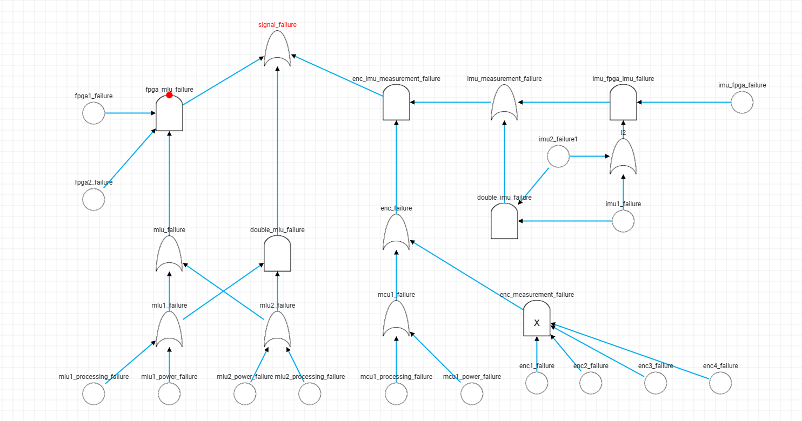

### Comparison

24-hour probability without IMU redundance: $1.642487861 \cdot 10^{-9}$
24-hour probability *with* IMU redundance: $5.9344 \cdot 10^{-10}$

4-year probability without IMU redundance: $1.46\cdot 10^{-6}$
4-year probability *with* IMU redundance: $8.66 \cdot 10^{-7}$

By adding redundancy through an extra IMU and an FPGA voter, we reached a 4-year failure probability of below $10^{-6}$.

## "ACC is unavaible" fault tree
The top level event is “The ACC is unavailable for some
reason”. Unavailability means that the system cannot perform its function as expected.
### Fault tree:

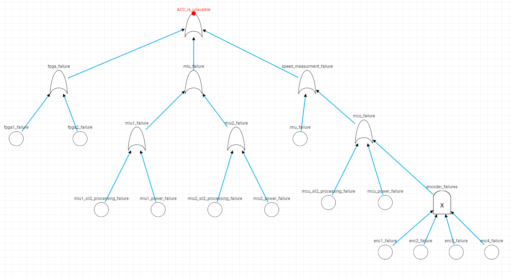

 ### Scenarios:
  - **FPGA failure**: In case of *fpga1_failure* OR *fpga2_failure*, the system will not function as expected, because it might either initiate safe emergency shutdown or derive the final command on *mlu_failure*

  - **MLU1_failure**: *mlu1_sil2_processing_failure* OR *mlu1_power_failure*, this leads the Main Logic Unit(1) to nondeterministic behavior

  - **MLU2_failure**: *mlu2_sil2_processing_failure* OR *mlu2_power_failure*, this leads the Main Logic Unit(2) to nondeterministic behavior

  - **MLU_failure**: In case of *MLU1_failure* OR *MLU2_failure*, the FPGA  voters will fail, and initiate safe emergency shutdown. In case of *MLU1_failure* AND *MLU2_failure* the FPGA voters might derive incorrect final command (E.g.: accelerate speed, when the bus should decelerate its speed).

  - **IMU_failure**: In case of *IMU_failure* the *3DM-GX5-10 IMU*, provides incorrect data of the current speed.

  - **enc(i)_failure**: The following *enc1_failure*, *enc2_failure*, *enc3_failure* and *enc4_failure* states represent the failure of an encoder. If an encoder fails, it will provide incorrect data of the current speed.

  - **Encoder_failures**: Voting gate, the *encoder_failures*'s threshold is 2. The *encoder_failures* occurs, when atleast 3 of the encoders (*enc(i)_failure*) failed.
   In this case the MCU does not provide usable speed data. 

- **MCU_failure**: Occurs in case of *mcu_sil2_processing_failure* OR *mcu_power_failure* OR *encoder_failures*, where the MCU might provide incorrect speed data.

- **Speed_measurment_failure**: Scenarios where *Speed_measurment_failure* occurs:
    - *mcu_failure* OR *imu_failure*: If at least one of the speed measurment method fails, <u>and measures a higher speed than the actual speed</u>, the MCU will choose the higher speed, which might lead to an incorrect ("E.g.: decelerate or maintain speed when the bus should accelerate") final command by the FPGAs. If on of the speed measurment method incorrectly measures a lower speed, the MCU will choose the higher speed data, what should not cause unexpected functionalities.

     - *mcu_failure* AND *imu_failure*: If both of the speed measurment method fail, the system will not have usable speed data, and will not function as expected.

- **ACC_is_unavaible**: Means that the system cannot perform its function as expected. Top level state, Occurs in case of *FPGA failure* OR *MLU_failure* OR *Speed_measurment_failure*

- **Power failures**: If the corresponding regulator fails to provide the correct voltage to a microcontroller, the microcontroller will show non-deterministic behavior.

- **Processing failures**: If a microcontroller fails at processing, it will not perform as expected.

##  Availability value of the ACC

To calculate the availability of the ACC, we use the following formula:  

$\frac{1 - e^{-\lambda M}}{\lambda  M}$

Where M is the length of a
maintenance period, and $\lambda$ is the failure rate of the component. In our calculation **M** will be **24** (hours), because at the end of each day, the vehicles
return to the maintenance station for **full** maintenance, and because repair time is negligible.

To calculate $\lambda$, we have to summarize the $\lambda$ of each event, based on their fauilure connections:

$\lambda$<small>FPGA</small> = $\frac{11}{10^9}$

$\lambda$<small>MCU</small> = $\frac{1000}{10^9}$

$\lambda$<small>regulator</small> = $\frac{15}{10^9}$

$\lambda$<small>encoder</small> = $\frac{580}{10^9}$

$\lambda$<small>IMU</small> = $\frac{1799.4}{10^9}$

The system has 2 FPGAs, 3 microcontrollers, regulator what is providing for 3 microntrollers, 4 encoders where failure occurs when at least 3 of them is faulty, and one IMU. Using the fault tree diagram, the summarized $\lambda$ can be calculated with:

$\lambda$<small>SUM</small> = 2 * $\lambda$<small>FPGA</small> + 3 * $\lambda$<small>MCU</small> + 3 * 

$\lambda$<small>regulator</small> + $\frac{\lambda_{\text{\small encoder}}}{3}$ + $\lambda$<small>IMU</small> 

After substituting the values:

$\lambda_{SUM} = 4.8714 \cdot 10^{-6}$

Now that **M** and **$\lambda$<small>SUM</small>** is known, we can calculate the availability of the ACC:

$Availability = \frac{1-e^{-4.8714 \cdot 10^{-6} \cdot 24}}{-4.8714 \cdot 10^{-6} \cdot 24} = 0.9999415$