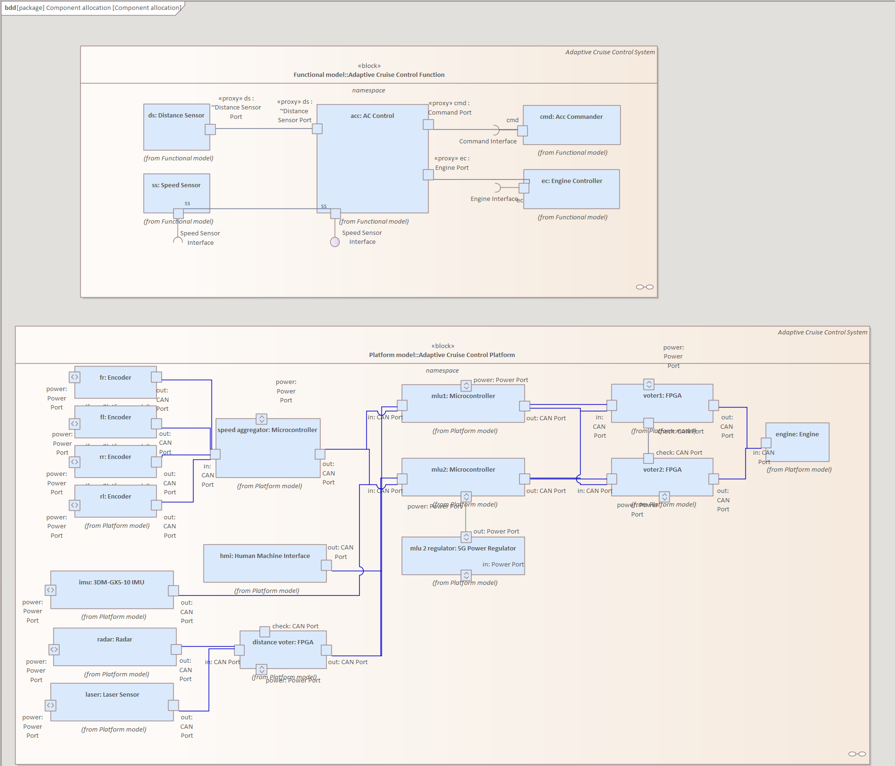
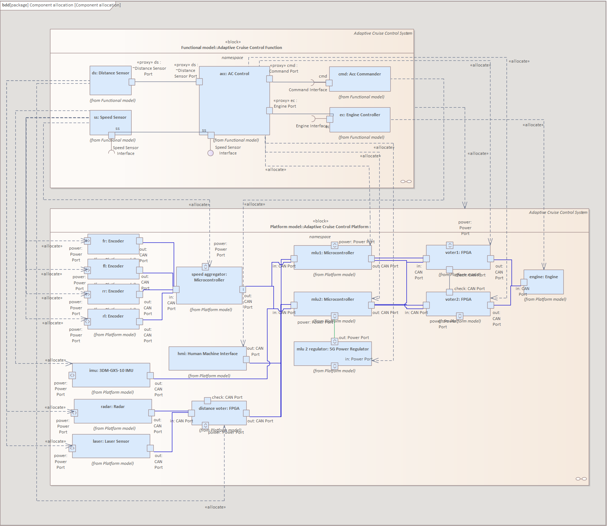
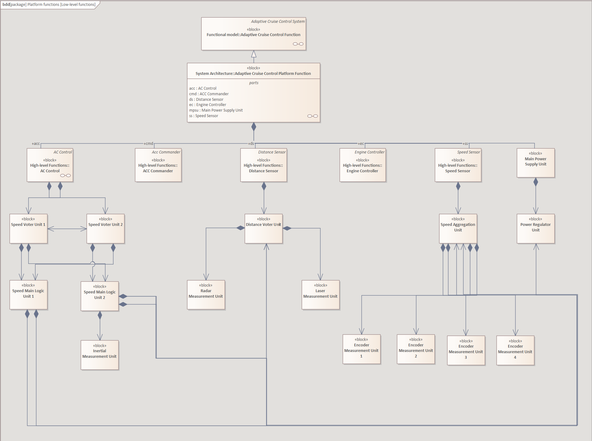
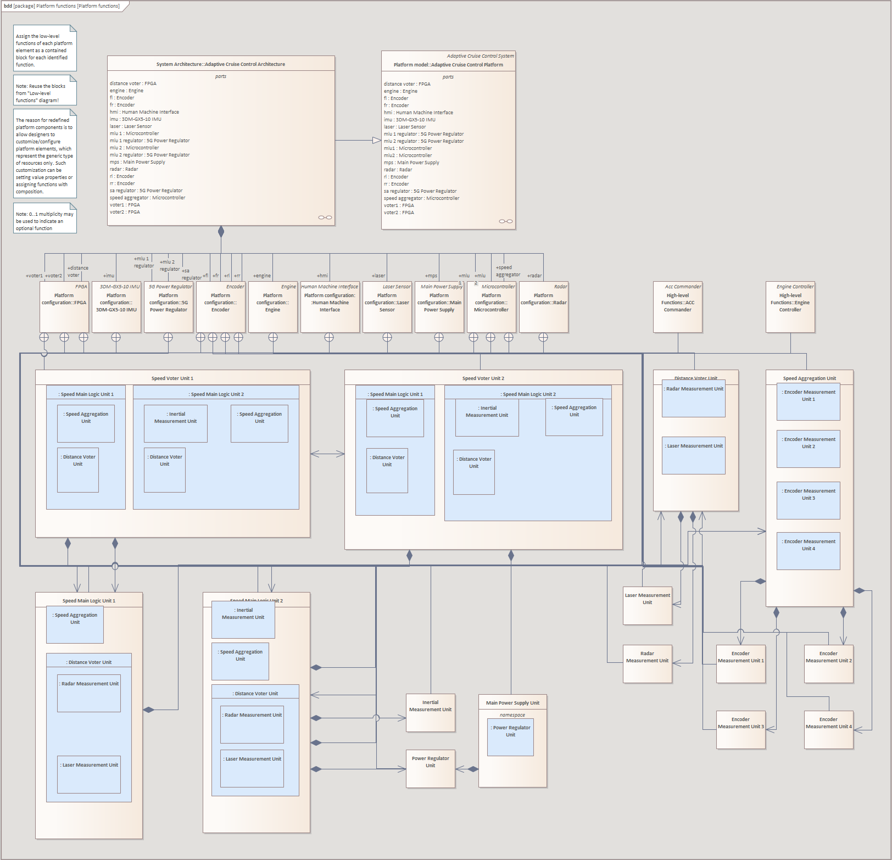
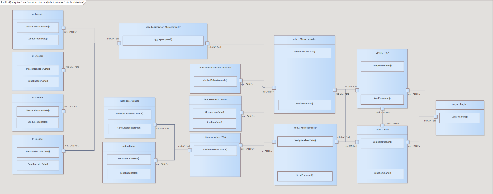

# Assignment 4

### **Overview of the weekly progression:**

##### **<ins>ACC</ins>**

Parallel to safety analysis, we have the **task of the functional analysis** of the <ins>Adaptive Cruise Control (ACC)</ins>
component. As an early prototype, we are planning to **use vehicles with safety drivers**. Initially, these drivers
can <ins>turn on the ACC</ins> if they decide that the traffic <ins>conditions are appropriate</ins>. If the **ACC is turned on**, then the vehicle is <ins>responsible for maintaining a controlled speed</ins>.

##### **<ins>High-level design</ins>**

Currently we are working with the following architecture for the ACC component. We will have **sensors to
measure the speed** of the vehicle and the **distance of other vehicles** on the road ahead (remember, this is
a functional model!). The **driver can issue commands** to the ACC through an unspecified <ins>Human Machine
Interface (HMI)</ins>, which will be operated by the <ins>ACC Commander function</ins>. Finally, the ACC is **connected to
the Engine Controller** to _accelerate_ or _decelerate_ the car. This overview of the structure can be seen in diagram
Adaptive Cruise Control / Adaptive Cruise Control Function Overview. The senior system engineers have **already created a model of the AC controller’s internal behaviour**. The model is located at Adaptive Cruise Control / Functional Model.

##### **<ins>Low-level architecture design</ins>**

As we have **finished designing the high-level functional aspects** of the ACC, it is time to <ins>allocate the functions
and design a system architecture</ins>. For this, the package Adaptive Cruise Control / Platform model contains
a **platform model** equivalent to the one described for the safety analysis (extended with distance sensors).
According to this, <ins>we have various sensors and computing units to be used redundantly</ins>, which will require
a **platform-specific refinement** of the high-level functional model to address the extra functional requirements
introduced by redundancy (as described in the previous assignment). Furthermore, the package Adaptive Cruise Control / System Architecture <ins>contains various diagrams and “boilerplate” elements</ins> prepared to help allocation and building a system architecture. The required steps along with the diagrams necessary to perform them are collected on Adaptive Cruise Control / Overview.

# Tasks - Allocation and system architecture

Specify the functional allocation and build a system architecture model.

- **a.** Perform the following steps to specify a functional allocation and derive a new level of decomposition for
  the functional architecture. - <ins>i.</ins> Allocate high-level components to platform elements. - <ins>ii.</ins> Define a low-level (platform-specific) decomposition for the ACC function based on the allocation. - <ins>iii.</ins> Assign the low-level functions to platform elements. - <ins>iv.</ins> Display the platform functions inside the realizing platform elements to specify which function to run where.
- **b.** The aim of the following steps is to map the communication between functions to physical communication paths and messages with concrete data representations (like 32-bit floating point numbers). You only need to perform these steps for a single example in this homework: the communication between the IMU and the MLUs (taking into account only the low-level functions that are allocated to these hardware components). - <ins>i.</ins> Specify how low-level functions interact with each other: add ports, introduce new logical signals, if
  necessary. - <ins>ii.</ins> Display ports of the low-level functions and allocate them to ports of the enclosing platform elements. - <ins>iii.</ins> Allocate signal and data types to platform data formats: create new subtypes of payload if necessary. - <ins>iv.</ins> Add item flows to the platform connections to show which logical item travels where.

---

## Allocation and system architecture:

#### **<ins>Functional allocation and derive a new level of decomposition for the functional architecture</ins>**

**<ins>i.</ins> Allocate high-level components to platform elements:**

Firstly the required steps along with the diagrams necessary to perform them are collected on **Adaptive Cruise Control / Overview**.

Here, the first link transfers to the <ins>Component Allocation BDD</ins>:

The first task is to **allocate high-level components to platform elements**, which we have made directly in the <ins>Component Allocation BDD</ins>.

Inside the diagram, we have <ins>two other diagrams "linked" to it</ins>, **the first one incorporates the high-level functional model** of the ACC, which has to be decomposed later, and **the other one incorporates the platform model**.

To keep in mind, as the description stated above, **the current high-level functional model does not fully allocable to the current platform based model**, because "<ins>we have various sensors and computing units to be used redundantly</ins>, which will require
a **platform-specific refinement** of the high-level functional model to address the extra functional requirements
introduced by redundancy", therefore in the first stage the current allocation represents a kind of "high-level" allocation in the first place. Therefore we have had to **refine our functional model** in the next phase to be consistent with the allocation.

**The created allocations are**:

_(functional model component -> platform model component)_

- ds: Distance Sensor ->
  - radar: Radar
  - laser: Laser Sensor
  - distance voter: FPGA
- ss: Speed Sensor ->
  - fr: Encoder
  - fl: Encoder
  - rr: Encoder
  - rl: Encoder
  - imu: 3DM-GX-5-10 IMU
  - speed aggregator: Microcontroller
- acc: AC Control ->
  - mlu1: Microcontroller
  - mlu2: Microcontroller
  - mlu2 regulator: 5G Power Regulator
  - voter1: FPGA
  - voter2: FPGA
- cmd: Acc Commander ->
  - hmi: Human Machine Interface
- ec: Engine Controller ->
  - engine: Engine

The **distance sensor** has been deployed to a <ins>radar, laser and to a FPGA</ins>.

The **speed sensor** has been deployed to <ins>four encoders, 3DM-GX5-10 IMU and to a Microcontroller</ins>.

The **ac control** has been deployed to <ins>two microcontrollers, two FPGAs and to a 5G power regulator</ins>.

The **acc commander** has been deployed to <ins>human machine interface</ins>.

The **engine controller** has been deployed to an <ins>engine</ins>.

**IMPORTANT: Connections are not allocated on the current diagram, we could not find any way how to perform this operation, but the connection allocations are clearly followed from the component allocation.**

---

**<ins>ii.</ins> Define a low-level (platform-specific) decomposition for the ACC function based on the allocation.**

To <ins>refine the functional model</ins> and <ins>complete the low-level functional model</ins> via **extend the high-level functional model**, it is obligatory to be aware with the **systems redundancy**, which is the key feature in this case. The <ins>last layer</ins> in the high-level functional model is the - _AC Control, ACC Commander, Distance Sensor, Engine Controller, Speed Sensor_ - **must be refined**, because the platform model has redundancy to <ins>ensure the systems robustness</ins>, therefore several sublayers should be added.

Based on the **safety analysis**, the </ins>redundancy must be provided</ins> in the low-level funtional model with the following:

- **Speed Sensor**

  - Should have a _Speed Aggregation Unit_ component
    - The speed aggregation should **provided by four Encoder Measurement Unit's data**

- **Distance Sensor**

  - Should have a _Distance Voter Unit_ component, which is <ins>based on the data of</ins>:
    - The _Radar Measurement Unit_
    - The _Laser Measurement Unit_

- **AC Control**

  - Should have two _Speed Voter Unit_ component, the two of them are **bounded together for result evaluation**
    - They get the data from the two _Speed Main Logic Unit_
      - Both of them **gets the data from** the _Speed Aggregation Unit_ Component and the _Distance Voter Unit_ component, additionally the **second MLU receive the results from** the _Inertial Measurement Unit_ component as well

- **Main Power Supply Unit**
  - Additionally a <ins>power supply</ins> has been added to the ACC with a specific:
    - _Power Regulator Unit_ component, which controls the power of the _Speed Main Logic Unit 2_ component

**To point out**, several parts of the _Speed Sensor_ and _Distance Sensor_ component <ins>have been connected into</ins> the _AC Control_ component too, the reason behind it was the **logic that in the higher levels of data comparison the controller should evaluate the final decision and command the other components** for further instruction.

---

**<ins>iii.</ins>Assign the low-level functions to platform elements.**

The freshly created <ins>low-level functionalities</ins> have been **assigned to the platform elements**, followed the convention between **the current** and the **i.** task.

---

**<ins>iv.</ins> Display the platform functions inside the realizing platform elements to specify which function to run where.**

As the section's last task, our team have had to display the the platform functions inside the realizing platform elements.

- **Encoders - (rr, rl, fl, fr)**

  - One by one has the **MeasureEncoderData()** function which will <ins>measure the movement of the wheel</ins> which has the encoder connected to it.
  - We have <ins>four encoders (rr, rl, fl, fr)</ins> for the <ins>four wheels</ins>.
  - These encoders will **send the measured data to the Microcontroller (speed aggregator)** for <ins>further analysis</ins>. This step is accomplished via the **SendEncoderData()** function.
  - **In low-level these two functions is only considered one, because of the tight bindig between them.**

- **Microcontroller - (speed aggregator)**

  - The microcontroller <ins>receive the data</ins> measured in the encoders, and from them with the help of **AggregateSpeed()** function it will <ins>execute the first phase analysis</ins> of the data to perform redundancy/robustness for the next stages.

- **Human Machine Interface - (hmi)**

  - The Hmi is stands for the <ins>bridge between the system and the driver</ins>, the **ControlDriverOverride()** function <ins>manages the signals sent by the driver</ins> with specific actions such as manul intervention.

- **3DM-GX5-10 IMU - (imu)**

  - The <ins>speed is measured with two layers<ins>, the first one was with the four encoders, but the **second one is performed with the imu**, which is the Inertial Measurement Unit.
  - Measure the data and send the data to the _MLU_ with the **MeasureImuData()** and **SendImuData()** functions.
  - **In low-level these two functions is only considered one, because of the tight bindig between them.**

- **Laser Sensor - (laser)**

  - For the <ins>distance measurement</ins> it is obligatory to use <ins>two layer of information gathering</ins> via **laser and radar data**, the first one is performed with a _laser sensor_, measure the environment with the **MeasureLaserSensorData()** function, and send it's results to the <ins>next layer FPGA (distance voter)</ins> by the **SendLaserSensorData()** function.
  - **In low-level these two functions is only considered one, because of the tight bindig between them.**

- **Radar - (radar)**

  - For the <ins>distance measurement</ins> it is obligatory to use <ins>two layer of information gathering</ins> via **laser and radar data**, the second one is performed with a _Radar_, measure the environment with the **MeasureRadarData()** function, and send it's results to the <ins>next layer FPGA (distance voter)</ins> by the **SendRadarData()** function.
  - **In low-level these two functions is only considered one, because of the tight bindig between them.**

- **FPGA - (distance voter)**

  - With the data recevied from the laser sensor and radar, **evulate the distance result** with the **EvaluateDistanceData()** which send the right singnals to the ACC as well.

- **Microcontroller - (mlu1, mlu2)**

  - Execute the second layer of system protection via redundancy, <ins>receive data from several components</ins> and **analyze it with the VerifyReceivedData()** function.
  - If necessary, these are <ins>able to command the system</ins> with the **SendCommand()** function.
  - **In low-level these two functions is only considered one, because of the tight bindig between them.**

- **FPGA - (voter1, voter2)**
  - The <ins>last layer</ins> between the _ACC_ and the _engine_, is the one contains the two voter FPGA.
  - <ins>Compare the received signals</ins> with the other one, and <ins>this cooperation is reverseable</ins> as well, the function used for it is **CompareDataSet()**.
  - The voters can **command the engine** with the instruction of the ACC with the **SendCommand()** function.
  - **In low-level these two functions is only considered one, because of the tight bindig between them.**

## IMU - MLU interactions

### Interactions of Low-Level Functions

On the IBD `Adaptive Cruise Control Platform Function`, we can find the `Inertial Measurement Unit` inside the Speed Sensor block, along with the `Speed Main Logic Unit`, inside the AC Control.

These component interact through the `imu_out` and `imu_in` ports. These ports are of type `Speed Sensor Port`, and as the IBD shows, the `CurrentSpeed` signal is transmitted through the proxy ports of the Speed Sensor block and the AC Control block.

The signal leaves and enters the components through two ports, which serves as extra redundancy to prevent communication failures.

## Relations of Low-Level Ports and Platform Elements

On the IBD `Adaptive Cruise Control Architecture`, we can see the blocks allocated to the ports specified in the previous section.
The diagram - from the previous section - is linked to the Architecture diagram, and the IMU's (full) `Speed Sensor Port` is connected to the IMU's egress port. Likewise, the Speed Main Logic Unit's Speed Sensor Port is allocated to the two microcontrollers, `mlu 1` and `mlu 2`.

Additionally, we have allocated the `Speed Main Logic Unit` to the microcontrollers, along with the `IMU` to the platform's _3DM-GX5-10 IMU_ block, for easier interpretation.

### Data formats

#### Data represenation

The _3DM-GX5-10 IMU_ provides multiple information about the vehicles movement: acceleration,
angular rate, ambient pressure, Delta-theta, Delta-velocity. In our diagram we will simplify the IMU's output to float, what declares the vehicle's current velocity in $\frac{m}{s}$.

In case of IMU-MLU interactions we specified a simple data structure:

<!-- 
img -->

We declared a _Speed_ block, what can be reusable for other elements as well (E.g.: encoders), the speed block contains a _speedValue_ variable with type float32. We use float32, because 32 bits are more than enough to represent the vehicle's velocity in $\frac{m}{s}$.

_3DM-GX5-10 IMU source: https://www.microstrain.com/sites/default/files/3dm-gx5-10_datasheet_8400-0095_rev_l.pdf_

#### Signal allocation

<!-- img
 -->

The _currentSpeed_ represents the current speed of the vehicle, the previously made _Speed_ block fits perfectly for that function: It can store the _currentSpeed_ in a float variable, hence the _currentSpeed_ allocates the _Speed_ block. The IMU's output declares a _currentSpeed_ property.

### Item flow

The IMU sends the _currentSpeed_ to both Main Logic Units.

<!-- img
 -->

Specified description: After IMU's _measureIMUData()_, the _sendImuData()_ will send the measured value to the MLU. The MLU's _verifyReceivedData()_ will verify if the _currentSpeed_ is a rational value (and it will compare the received value with the encoders output velocity, and choose the maximum of the two).
