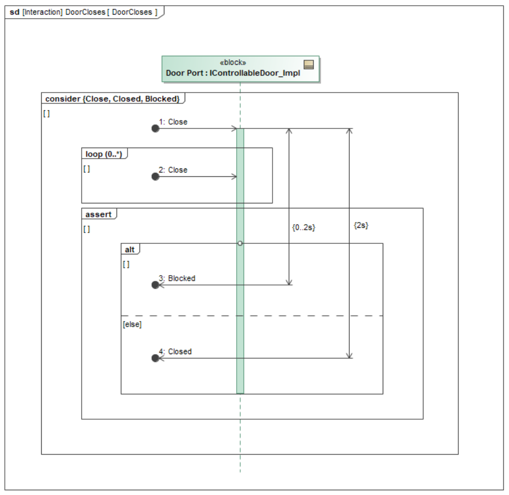
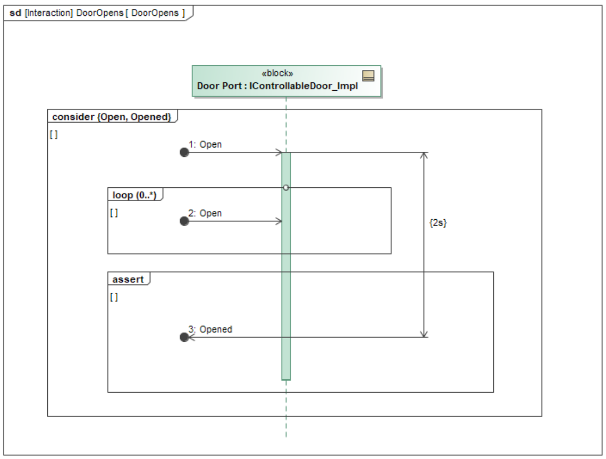
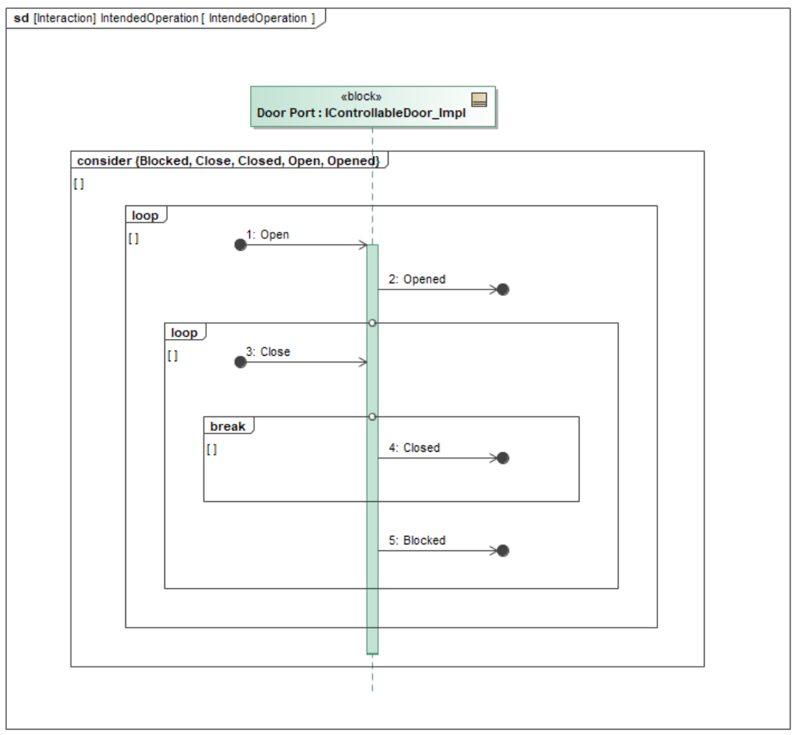
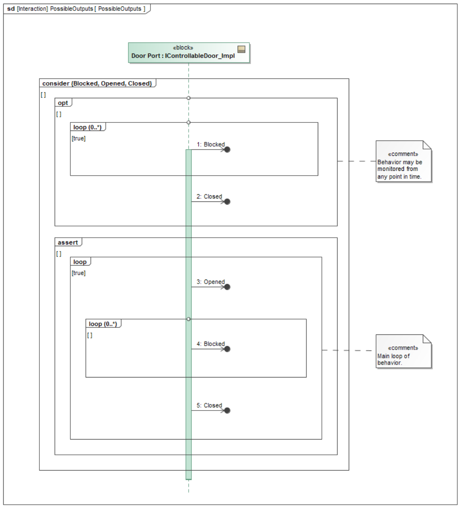
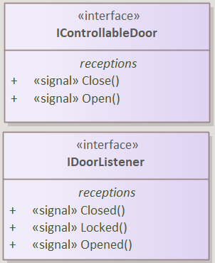
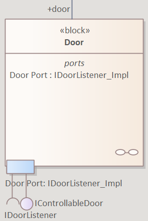
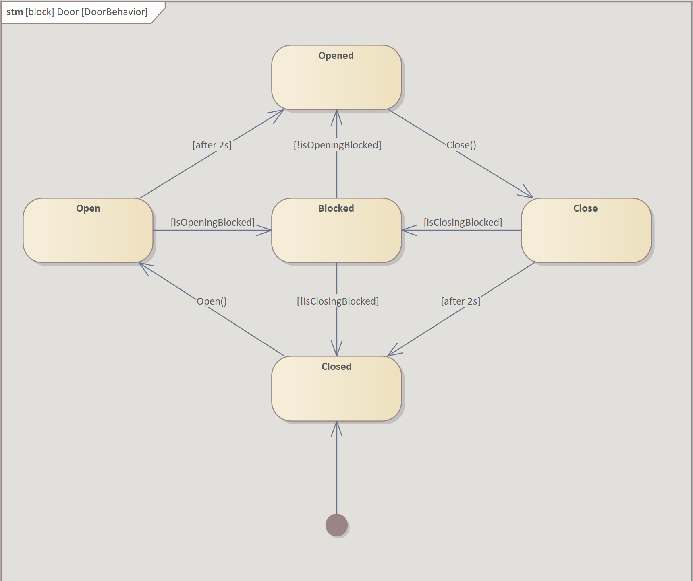
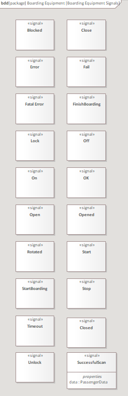

# Assignment 5 - Behavior Modeling

## **Task a.**

#### <ins>Task description</ins>

"Create a **State Machine model** of the <ins>behavior of the door</ins> in the empty State Machine Diagram IntelliBus *System/4 - Functional Architecture/4.1 Functional decomposition/Boarding Equipment/Door/DoorBehavior/DoorBehavior*. Make sure the state machine **conforms to the behavior** specified on the <ins>Sequence Diagrams</ins>."

#### <ins>Documentation</ins>

Our development team **received several sequence diagrams** how the door <ins>component's interacts</ins> with each other, which should be the base of the door component's state machine.

**Sequence diagram** -> *DoorCloses*

**Sequence diagram** -> *DoorOpens*

**Sequence diagram** -> *IntendedOperation*

**Sequence diagram** -> *PossibleOutputs*

**BDD** -> *Passenger Control Device*

**Block** -> *Door*

According to the <ins>sequence diagrams above</ins>, and the <ins>**interfaces**<ins> which are represented in the component's porting, the **door's state machine should have**:

- **Five states**

    - *Closed*

        - The state machine's **starting state**

        - The state represents the **door closing's final state**, where <ins>after the 2s</ins> closing time the <ins>door is eventually closed</ins>

        - The door's <ins>opening can be requested</ins> from the state Closed, with the function **call Open()** (defined in the *IControllableDoor* interface)

    - *Open*

        - The state represents the action while **the door is opening**, which <ins>takes 2s</ins> in standard conditions, within this period of time, <ins>block can be requested</ins> with the **isOpeningBlocked** parameter set to true

            - *For instance if a **passenger standing in the door's opening area** it <ins>should be blocked</ins> for safety reasons*

    - *Opened*

        - The state represents the **door opening's final state**, where <ins>after the 2s</ins> closing time the <ins>door is eventually closed</ins>

    - *Close*

        - The state represents the action while **the door is closing**, which <ins>takes 2s</ins> in standard conditions, within this period of time, <ins>block can be requested</ins> with the **isClosingBlocked** parameter set to true

            - *For instance if a **passenger standing in the door's closing area** it <ins>should be blocked</ins> for safety reasons*

    - *Blocked*

        - The state represents the door's **blocked state**, which can be <ins>triggered from two other states</ins>, these are the state *Open* and *Close*

        - The state's purpose for existence is to **detect safety and hardver issues**, such as <ins>accidents</ins> coming from passengers bad positioning or <ins>broken opening/closing mechanism</ins>

        - If the system is **in normal condition**, with the assistance of **isOpeningBlocked/isClosingBlocked** parameters set to false, can be <ins>transitioned to</ins> state *Opened* and *Closed*, for the goal to **accomplish one of the activity's "final state"** 

**<ins>NOTE:</ins>** **the sequence diagrams do not define specific actions for the state Blocked's trigger conditions, hence these are created with precision and safety in mind**. 

**State machine** -> *DoorBehaviour*

---

## Activity Diagram Of the RFID Scanner
1. **Diagram**
2. **Specification**
3. **Glossary**
4. **Sources**

### 1. **Diagram**:

*IntelliBus System/4 - Functional Architecture/4.1 Functional decomposition/Boarding Equipment/RFID Behavior*

### 2. **Specification**:
After the *Turn On* initial node, the system enters the *ScannerInterruptibleRegion*, this region can be interrupted with *Receiving Off Signal* (Sources: Boarding Equipment Signals). Since we turned on the scanner, it can be turned off at any given time. After receiving *Off* signal, the scanner leaves the *ScannerInterruptibleRegion*, and moves on to the *ShutDown* action, that handles shutdown processes. Once the shutdown processes are complete, the system reaches its final state: Turn Off

The *ScannerInterruptibleRegion* starts with the *Initialize* action, after the initializing is done, the *Listening* action begins, in the *ListeningInterruptibleRegion*. The interruptible region can be interrupted by *Receiving Start signal* (Sources: Boarding Equipment Signals). 

If start signal is received in the *Listening* action, the  *Read RFID* action begins, in the 
*ReadRFIDInterruptibleRegion*, what can be interrupted by *Receiving Stop signal* (Sources: Boarding Equipment Signals) or with timeout, if the system is in the *ReadRFIDInterruptibleRegion* for more than 5 seconds.
- In case *Receiving Stop signal* the scanner stops the current action within the *ReadRFIDInterruptibleRegion*, and returns then continues with the *Listening* action.
- In case of timeout, the *Send TimeOut Signal* action begins, the scanner sends a *Timeout* signal (Sources: Boarding Equipment Signals) to the scanner port (Sources: Boarding Equipment)

When reading is completed in the *Read RFID* action, it passes the *Process Raw Data* action an *RFIDRawData* (Sources: Enums and types) object. 

When the raw data is processed in the *Process Raw Data* action, it passes the *PassengerData* (Sources: Enums and types) object to the *SendSignal* action. In this action the scanner sends the *scanner* port (Sources: Boarding Equipment) a *SuccesfulScan* signal (Sources: Boarding Equipment Signals), this interface has the *PassengerData* property.

After sending the signal, the scanner returns then continues with the *Listening* action, waiting for the next *Start* signal. 

*Note that an action that is inside multiple InterruptibleRegion, can be interrupted with multiple signals. e.g: *Listening* action can be interrupted with an *Off* signal (*ShutDown* action starts), and *Stop* signal (*Read RFID* action starts) aswell.* 

### 3. **Glossary**:
#### Nodes:
- **Turn On**: Initial node, produces a control token when the Activity is invoked, the scanner's activity is invoked by *turning on* the scanner.
- **Turn Off**: Final node, removes all control tokens and returns from the Activity.
#### Actions:
- **Initialize**: Initializing. 
- **Listening**: Waiting for a *start* signal. 
- **Read RFID**: Reading RFID data.
- **Process Raw Data**: Processing raw RFID data.
- **SendSignal**: Sending signal to the *scanner* port (Send Signal type action).
- **Send TimeOut Signal**: Sending timeout signal to the *scanner* port (Send Signal type action).
- **ShutDown**: Shutting down.
#### Accept event actions:
- **Receiving Start signal**: Receives a *Start* signal
- **Receiving Stop signal**: Receives a *Stop* signal
- **Receiving Off signal**: Receives an *Off* signal

#### Interrupt regions:
- **ScannerInterruptibleRegion**: Contains all action except ShutDown.
- **ListeningInterruptibleRegion**: Contains the *Listening* action
- **ReadRFIDInterruptibleRegion**: Contains *Read RFID*, *Process Raw Data* and *SendSignal* actions

### 4. **Sources**:

#### The signals are used from the following model:
(Boarding Equipment Signals)

 

*IntelliBus System/4 - Functional Architecture/4.4 Signals/Boarding Equipment/Boarding Equipment Signals*

#### The scanner's port is used from the following model:
(Boarding Equipment)

 

*IntelliBus System/4 - Functional Architecture/4.1 Functional decomposition/Boarding Equipment*

#### Data types in *ReadRFIDInterruptibleRegion* are used from model:
(Enums and types)

 

*IntelliBus System/4 - Functional Architecture/4.4 Signals/Enums and types*

---

## Boarding Controller's State Machine

### Main States

The Boarding Controller's operations can be broken down into three main states: `Boarding Forbidden` (when the `StartBoarding` signal hasn't arrived yet), `Boarding` (when passengers can board the vehicle), and `Terminating` (when the controller is waiting for the processes to die down before terminating the boarding phase).

#### Boarding

The controller enters the Boarding state when it receives the `StartBoarding` signal through its `Status Port`. After receiving the signal, the controller calls the `Door Port` to open the door and start onboarding passengers. When the door is finally in `Opened` status, the controller turns on the `RFID Scanner`. We consider `Timeout` the rejection of a passenger, since there was no other event to model this. In this case, the alarm is turned `On` for 500 milliseconds.

On `SuccessfulScan`, we call `Unlock` on `Turnstile`. If the turnstile unlocks and it is `Rotated` or 5 seconds pass, we call the `Turnstile` to `Lock` itself. If it can not, the `Unlock` request is repeated every second.

After successfully locking the turnstile, new passengers can board the vehicle in a similar fashion.

#### Terminating

When the `FinishBoarding` signal arrives through the status port, the controller closes the doors, closes the turnstile (if applicable), turns off the alarm (if applicable) and turns off the RFID Scanner. If this cannot be finished in 10 seconds, the controller shuts off. Otherwise, the boarding process is finished and the doors are locked.